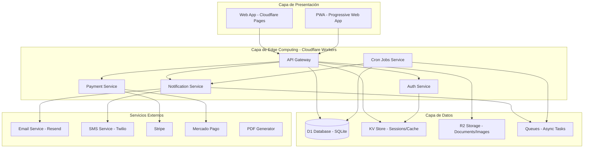
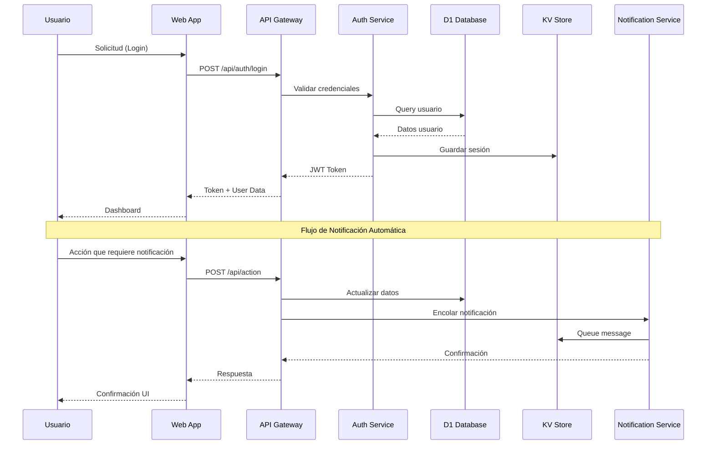
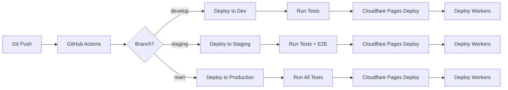
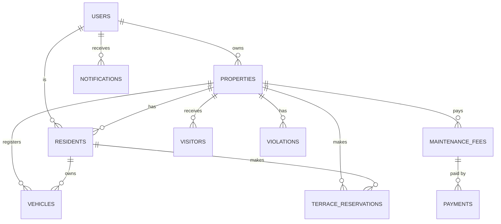
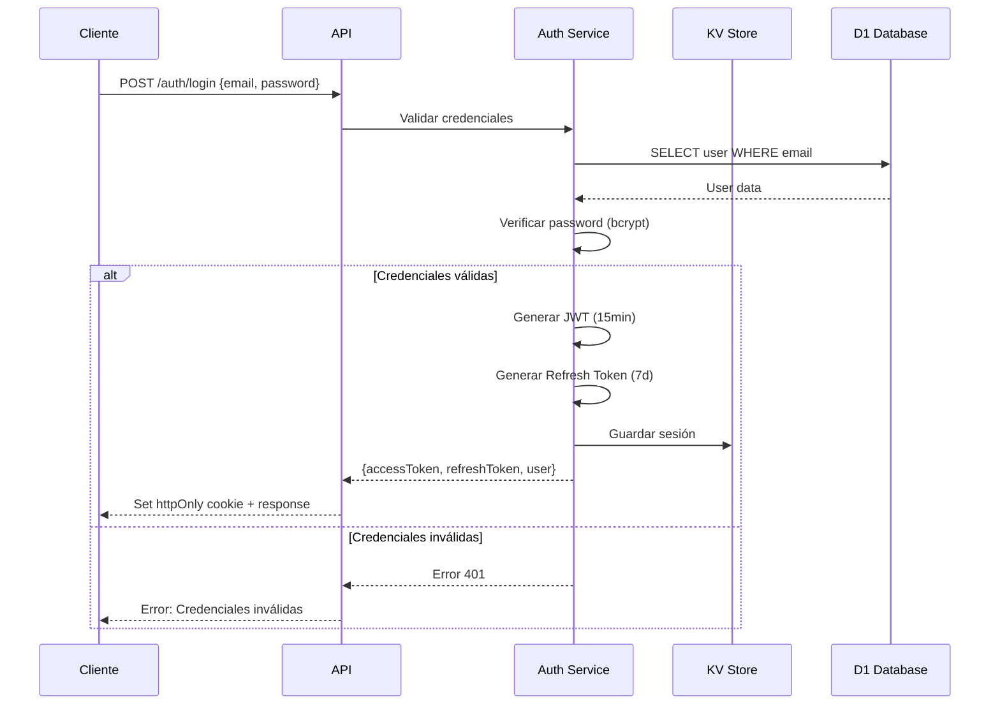
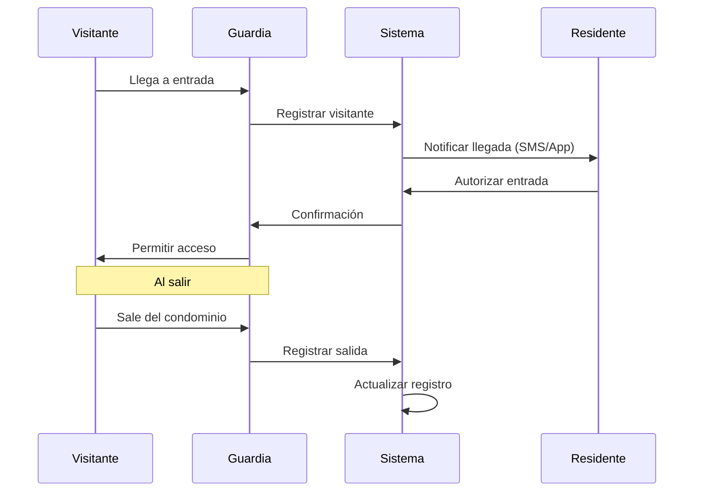
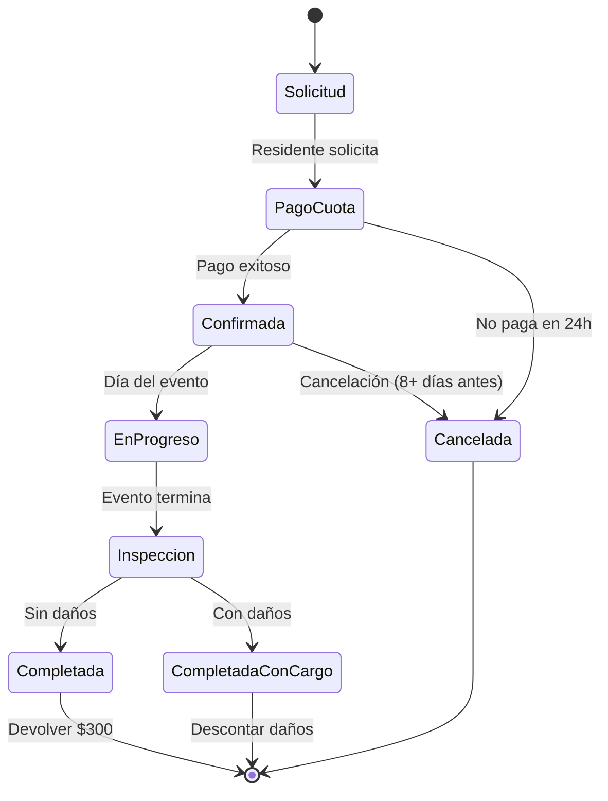
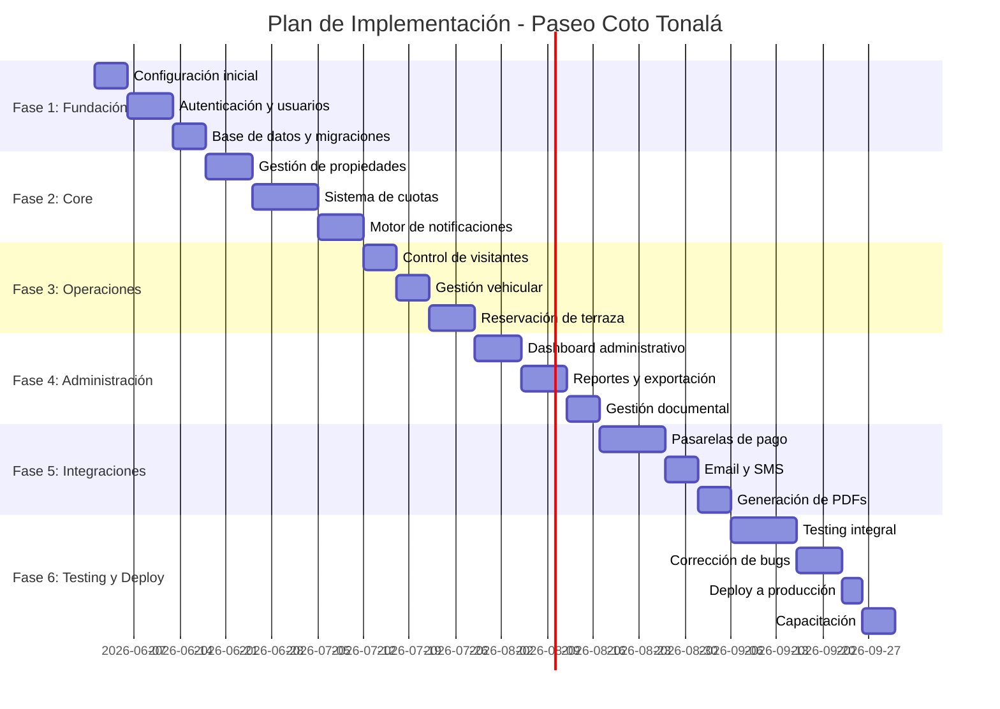

# Plan Arquitectónico - Sistema de Administración Paseo Coto Tonalá

## Información del Proyecto

**Nombre:** Sistema de Administración de Condominio Paseo Coto Tonalá  
**Tipo:** Aplicación Web Cloud-Native  
**Unidades:** 130 casas  
**Ubicación:** Tonalá, Jalisco, México  
**Versión del Plan:** 1.0  
**Fecha:** Mayo 2026

---

## Tabla de Contenidos

1. [Arquitectura del Sistema](#1-arquitectura-del-sistema)
2. [Stack Tecnológico](#2-stack-tecnológico)
3. [Diseño de Base de Datos](#3-diseño-de-base-de-datos)
4. [Sistema de Autenticación](#4-sistema-de-autenticación)
5. [Módulos Principales](#5-módulos-principales)
6. [Automatizaciones](#6-automatizaciones)
7. [Integraciones](#7-integraciones)
8. [Ambiente de Desarrollo](#8-ambiente-de-desarrollo)
9. [Plan de Implementación](#9-plan-de-implementación)
10. [Documentación](#10-documentación)

---

## 1. Arquitectura del Sistema

### 1.1 Visión General

El sistema será una aplicación web cloud-native optimizada para la infraestructura de Cloudflare, aprovechando su red global de edge computing para ofrecer baja latencia y alta disponibilidad.

**Principios Arquitectónicos:**
- ✅ Cloud-native first
- ✅ Edge computing para baja latencia
- ✅ Serverless para escalabilidad automática
- ✅ Seguridad por diseño
- ✅ Monitoreo y observabilidad integrados

### 1.2 Diagrama de Arquitectura



### 1.3 Componentes Principales

#### 1.3.1 Frontend (Cloudflare Pages)
- **Framework:** Next.js 14+ con App Router
- **Rendering:** SSR + SSG + ISR
- **Deployment:** Cloudflare Pages con edge rendering
- **CDN:** Automático vía Cloudflare
- **PWA:** Soporte offline y notificaciones push

#### 1.3.2 Backend (Cloudflare Workers)
- **Patrón:** Monolito modular con separación de concerns
- **Framework:** Hono.js (ultrarrápido, compatible con Workers)
- **Arquitectura:** Hexagonal/Clean Architecture
- **API:** RESTful con OpenAPI 3.0

#### 1.3.3 Base de Datos
- **Principal:** D1 (SQLite distribuido)
- **Cache:** KV Store para sesiones y datos frecuentes
- **Storage:** R2 para documentos y archivos

### 1.4 Flujo de Datos



### 1.5 Estrategia de Deployment

#### Ambientes

1. **Development**
   - Branch: `develop`
   - URL: `dev.paseo-coto.pages.dev`
   - Base de datos: D1 Development
   - Variables: `.env.development`

2. **Staging**
   - Branch: `staging`
   - URL: `staging.paseo-coto.pages.dev`
   - Base de datos: D1 Staging
   - Variables: `.env.staging`

3. **Production**
   - Branch: `main`
   - URL: `app.paseocoto.com` (dominio personalizado)
   - Base de datos: D1 Production
   - Variables: `.env.production`

#### Pipeline CI/CD



**Proceso de Deployment:**
1. Push a branch correspondiente
2. GitHub Actions ejecuta tests
3. Build de aplicación
4. Deploy a Cloudflare Pages
5. Deploy de Workers
6. Ejecutar migraciones de DB (si aplica)
7. Smoke tests
8. Notificación de resultado

---

## 2. Stack Tecnológico

### 2.1 Frontend

#### Framework Principal: **Next.js 14+**

**Justificación:**
- ✅ Excelente integración con Cloudflare Pages
- ✅ App Router con Server Components para mejor performance
- ✅ SSR/SSG/ISR para SEO y velocidad
- ✅ TypeScript nativo
- ✅ Gran ecosistema y comunidad
- ✅ Optimización automática de imágenes y fuentes
- ✅ Soporte para PWA

**Configuración:**
```javascript
// next.config.js
module.exports = {
  output: 'export', // Para Cloudflare Pages
  images: {
    unoptimized: true // Cloudflare maneja optimización
  }
}
```

#### UI Framework: **Tailwind CSS + shadcn/ui**

**Justificación:**
- ✅ Componentes accesibles y personalizables
- ✅ Diseño responsive por defecto
- ✅ Excelente DX (Developer Experience)
- ✅ Bundle size optimizado
- ✅ Tema oscuro/claro integrado
- ✅ Componentes pre-construidos de alta calidad

**Componentes Principales:**
- Forms (Input, Select, Checkbox, Radio)
- Data Display (Table, Card, Badge)
- Feedback (Alert, Toast, Dialog)
- Navigation (Tabs, Breadcrumb, Pagination)
- Overlay (Modal, Drawer, Popover)

#### Estado Global: **Zustand + React Query**

**Justificación:**
- ✅ Zustand: Simple, ligero, sin boilerplate
- ✅ React Query: Cache inteligente, sincronización automática
- ✅ Excelente para datos del servidor
- ✅ DevTools integrados
- ✅ TypeScript support completo

**Estructura:**
```typescript
// stores/auth.ts
import { create } from 'zustand'

interface AuthState {
  user: User | null
  token: string | null
  login: (email: string, password: string) => Promise<void>
  logout: () => void
}

export const useAuthStore = create<AuthState>((set) => ({
  user: null,
  token: null,
  login: async (email, password) => {
    // implementación
  },
  logout: () => set({ user: null, token: null })
}))
```

#### Formularios: **React Hook Form + Zod**

**Justificación:**
- ✅ Validación type-safe
- ✅ Performance optimizado (menos re-renders)
- ✅ Integración con TypeScript
- ✅ Validación compartida con backend
- ✅ Excelente manejo de errores

### 2.2 Backend

#### Framework: **Hono.js**

**Justificación:**
- ✅ Diseñado específicamente para Cloudflare Workers
- ✅ Ultrarrápido (más rápido que Express)
- ✅ TypeScript first
- ✅ Middleware system robusto
- ✅ Compatible con Web Standards
- ✅ Excelente documentación

**Estructura:**
```typescript
import { Hono } from 'hono'
import { cors } from 'hono/cors'
import { logger } from 'hono/logger'
import { jwt } from 'hono/jwt'

const app = new Hono()

app.use('*', cors())
app.use('*', logger())
app.use('/api/*', jwt({ secret: env.JWT_SECRET }))

app.get('/api/health', (c) => c.json({ status: 'ok' }))

export default app
```

#### ORM: **Drizzle ORM**

**Justificación:**
- ✅ Excelente soporte para D1
- ✅ Type-safe queries
- ✅ Migraciones automáticas
- ✅ Ligero y rápido
- ✅ SQL-like syntax
- ✅ Relaciones type-safe

**Ejemplo:**
```typescript
import { drizzle } from 'drizzle-orm/d1'
import { eq } from 'drizzle-orm'
import * as schema from './schema'

const db = drizzle(env.DB, { schema })

// Query type-safe
const users = await db.query.users.findMany({
  where: eq(schema.users.email, 'user@example.com'),
  with: {
    properties: true
  }
})
```

#### Validación: **Zod**

**Justificación:**
- ✅ Compartido entre frontend y backend
- ✅ Type inference automático
- ✅ Mensajes de error personalizables
- ✅ Validación de runtime
- ✅ Transformaciones de datos

**Schemas Compartidos:**
```typescript
// shared/schemas/user.ts
import { z } from 'zod'

export const loginSchema = z.object({
  email: z.string().email('Email inválido'),
  password: z.string().min(8, 'Mínimo 8 caracteres')
})

export type LoginInput = z.infer<typeof loginSchema>
```

### 2.3 Base de Datos

#### Principal: **Cloudflare D1**

**Justificación:**
- ✅ SQLite distribuido globalmente
- ✅ Baja latencia (edge computing)
- ✅ Sin cold starts
- ✅ Costo-efectivo ($5/mes para 5GB)
- ✅ Backups automáticos
- ✅ Escalabilidad horizontal
- ✅ Consistencia fuerte en escrituras

**Límites y Consideraciones:**
- 📊 10GB por base de datos (suficiente para 130 casas)
- 📊 100,000 lecturas/día (plan gratuito)
- 📊 50,000 escrituras/día (plan gratuito)
- ⚠️ Eventual consistency en réplicas (< 1 segundo)
- ✅ Consistencia fuerte en escrituras

**Estimación de Uso:**
```
130 casas × 12 meses × 5 años = 7,800 registros de cuotas
130 casas × 3 vehículos = 390 vehículos
130 casas × 10 visitantes/mes = 15,600 visitantes/año
Total estimado: < 100,000 registros = < 500MB
```

#### Alternativa Evaluada: **PostgreSQL Externo (Neon/Supabase)**

**Por qué NO se eligió:**
- ❌ Mayor latencia (no está en el edge)
- ❌ Costo adicional ($20-50/mes)
- ❌ Complejidad de configuración
- ❌ No aprovecha la infraestructura de Cloudflare
- ❌ Cold starts en conexiones

**Cuándo considerar PostgreSQL:**
- Si se requieren más de 10GB de datos
- Si se necesitan features avanzados (full-text search complejo, PostGIS)
- Si se requiere consistencia inmediata global
- Si se necesitan stored procedures complejos

### 2.4 Storage y Cache

#### Documentos: **Cloudflare R2**

**Justificación:**
- ✅ Compatible con S3 API
- ✅ Sin costos de egress (ahorro significativo)
- ✅ Almacenamiento económico ($0.015/GB/mes)
- ✅ CDN integrado
- ✅ Durabilidad 99.999999999%

**Uso:**
- 📄 Documentos PDF (contratos, recibos, reglamento)
- 🖼️ Imágenes de perfil
- 💳 Comprobantes de pago
- 📋 Actas de asamblea
- 📊 Reportes generados

**Estructura de Carpetas:**
```
/documents
  /regulations
  /contracts
  /receipts
  /reports
/images
  /profiles
  /properties
/uploads
  /temp
```

#### Cache: **Cloudflare KV**

**Justificación:**
- ✅ Latencia ultra-baja (<1ms en el edge)
- ✅ Distribución global automática
- ✅ Ideal para sesiones y cache
- ✅ 1GB gratis, luego $0.50/GB

**Uso:**
- 🔐 Sesiones de usuario (JWT refresh tokens)
- 💾 Cache de consultas frecuentes
- 🚦 Rate limiting por IP
- 🎛️ Feature flags
- ⚙️ Configuraciones del sistema

**Estrategia de Cache:**
```typescript
// Cache de 1 hora para datos estáticos
await kv.put('system:settings', JSON.stringify(settings), {
  expirationTtl: 3600
})

// Cache de 5 minutos para datos dinámicos
await kv.put(`user:${userId}:profile`, JSON.stringify(profile), {
  expirationTtl: 300
})
```

### 2.5 Autenticación y Seguridad

#### Estrategia: **JWT + Refresh Tokens**

**Implementación:**
- 🔑 Access Token: 15 minutos (en memoria)
- 🔄 Refresh Token: 7 días (httpOnly cookie)
- 💾 Almacenamiento de sesiones en KV
- 🔒 Rotación de refresh tokens

**Seguridad:**
- 🛡️ CSRF protection con tokens
- 🚦 Rate limiting por IP (100 req/min)
- 🔐 Passwords hasheados con bcrypt (cost 12)
- 📝 Audit logs de acciones críticas
- 🚫 Detección de sesiones concurrentes
- 🔓 Logout en todos los dispositivos

**Librerías:**
```json
{
  "dependencies": {
    "hono": "^3.x",
    "@hono/jwt": "^1.x",
    "bcryptjs": "^2.x",
    "zod": "^3.x"
  }
}
```

---

## 3. Diseño de Base de Datos

### 3.1 Esquema Completo

El esquema de base de datos está diseñado para soportar todas las funcionalidades del sistema con relaciones claras y optimizaciones para consultas frecuentes.

#### 3.1.1 Usuarios y Autenticación

```sql
CREATE TABLE users (
    id TEXT PRIMARY KEY DEFAULT (lower(hex(randomblob(16)))),
    email TEXT UNIQUE NOT NULL,
    password_hash TEXT NOT NULL,
    role TEXT NOT NULL CHECK(role IN ('super_admin', 'admin', 'resident')),
    status TEXT NOT NULL DEFAULT 'active' CHECK(status IN ('active', 'inactive', 'suspended')),
    email_verified INTEGER DEFAULT 0,
    created_at INTEGER NOT NULL DEFAULT (unixepoch()),
    updated_at INTEGER NOT NULL DEFAULT (unixepoch()),
    last_login_at INTEGER
);

CREATE INDEX idx_users_email ON users(email);
CREATE INDEX idx_users_role ON users(role);
CREATE INDEX idx_users_status ON users(status);
```

#### 3.1.2 Propiedades y Residentes

```sql
CREATE TABLE properties (
    id TEXT PRIMARY KEY DEFAULT (lower(hex(randomblob(16)))),
    house_number TEXT UNIQUE NOT NULL,
    street TEXT NOT NULL,
    owner_id TEXT,
    status TEXT NOT NULL DEFAULT 'occupied' CHECK(status IN ('occupied', 'vacant', 'rented')),
    property_type TEXT DEFAULT 'house' CHECK(property_type IN ('house', 'apartment')),
    bedrooms INTEGER,
    bathrooms INTEGER,
    parking_spaces INTEGER DEFAULT 1,
    created_at INTEGER NOT NULL DEFAULT (unixepoch()),
    updated_at INTEGER NOT NULL DEFAULT (unixepoch()),
    FOREIGN KEY (owner_id) REFERENCES users(id) ON DELETE SET NULL
);

CREATE INDEX idx_properties_house_number ON properties(house_number);
CREATE INDEX idx_properties_owner ON properties(owner_id);
CREATE INDEX idx_properties_status ON properties(status);

CREATE TABLE residents (
    id TEXT PRIMARY KEY DEFAULT (lower(hex(randomblob(16)))),
    user_id TEXT NOT NULL,
    property_id TEXT NOT NULL,
    relationship TEXT NOT NULL CHECK(relationship IN ('owner', 'tenant', 'family', 'guest')),
    start_date INTEGER NOT NULL,
    end_date INTEGER,
    is_primary INTEGER DEFAULT 0,
    identification_type TEXT,
    identification_number TEXT,
    identification_document_url TEXT,
    phone TEXT,
    emergency_contact_name TEXT,
    emergency_contact_phone TEXT,
    created_at INTEGER NOT NULL DEFAULT (unixepoch()),
    updated_at INTEGER NOT NULL DEFAULT (unixepoch()),
    FOREIGN KEY (user_id) REFERENCES users(id) ON DELETE CASCADE,
    FOREIGN KEY (property_id) REFERENCES properties(id) ON DELETE CASCADE
);

CREATE INDEX idx_residents_user ON residents(user_id);
CREATE INDEX idx_residents_property ON residents(property_id);
CREATE INDEX idx_residents_relationship ON residents(relationship);
```

#### 3.1.3 Cuotas y Pagos

```sql
CREATE TABLE maintenance_fees (
    id TEXT PRIMARY KEY DEFAULT (lower(hex(randomblob(16)))),
    property_id TEXT NOT NULL,
    amount REAL NOT NULL,
    discount_amount REAL DEFAULT 0,
    surcharge_amount REAL DEFAULT 0,
    total_amount REAL NOT NULL,
    due_date INTEGER NOT NULL,
    payment_period TEXT NOT NULL,
    status TEXT NOT NULL DEFAULT 'pending' CHECK(status IN ('pending', 'paid', 'overdue', 'cancelled')),
    payment_date INTEGER,
    payment_method TEXT,
    payment_reference TEXT,
    notes TEXT,
    created_at INTEGER NOT NULL DEFAULT (unixepoch()),
    updated_at INTEGER NOT NULL DEFAULT (unixepoch()),
    FOREIGN KEY (property_id) REFERENCES properties(id) ON DELETE CASCADE
);

CREATE INDEX idx_fees_property ON maintenance_fees(property_id);
CREATE INDEX idx_fees_status ON maintenance_fees(status);
CREATE INDEX idx_fees_period ON maintenance_fees(payment_period);
CREATE INDEX idx_fees_due_date ON maintenance_fees(due_date);

CREATE TABLE payments (
    id TEXT PRIMARY KEY DEFAULT (lower(hex(randomblob(16)))),
    maintenance_fee_id TEXT NOT NULL,
    property_id TEXT NOT NULL,
    amount REAL NOT NULL,
    payment_method TEXT NOT NULL CHECK(payment_method IN ('cash', 'transfer', 'card', 'stripe', 'mercadopago')),
    payment_reference TEXT,
    payment_date INTEGER NOT NULL,
    status TEXT NOT NULL DEFAULT 'pending' CHECK(status IN ('pending', 'completed', 'failed', 'refunded')),
    gateway_transaction_id TEXT,
    gateway_response TEXT,
    receipt_url TEXT,
    notes TEXT,
    created_by TEXT,
    created_at INTEGER NOT NULL DEFAULT (unixepoch()),
    updated_at INTEGER NOT NULL DEFAULT (unixepoch()),
    FOREIGN KEY (maintenance_fee_id) REFERENCES maintenance_fees(id) ON DELETE CASCADE,
    FOREIGN KEY (property_id) REFERENCES properties(id) ON DELETE CASCADE,
    FOREIGN KEY (created_by) REFERENCES users(id) ON DELETE SET NULL
);

CREATE INDEX idx_payments_fee ON payments(maintenance_fee_id);
CREATE INDEX idx_payments_property ON payments(property_id);
CREATE INDEX idx_payments_status ON payments(status);
```

#### 3.1.4 Vehículos y Visitantes

```sql
CREATE TABLE vehicles (
    id TEXT PRIMARY KEY DEFAULT (lower(hex(randomblob(16)))),
    property_id TEXT NOT NULL,
    resident_id TEXT,
    make TEXT NOT NULL,
    model TEXT,
    color TEXT NOT NULL,
    license_plate TEXT UNIQUE NOT NULL,
    year INTEGER,
    vehicle_type TEXT DEFAULT 'car' CHECK(vehicle_type IN ('car', 'motorcycle', 'truck', 'van', 'suv')),
    access_control_number TEXT,
    is_active INTEGER DEFAULT 1,
    registered_at INTEGER NOT NULL DEFAULT (unixepoch()),
    created_at INTEGER NOT NULL DEFAULT (unixepoch()),
    updated_at INTEGER NOT NULL DEFAULT (unixepoch()),
    FOREIGN KEY (property_id) REFERENCES properties(id) ON DELETE CASCADE,
    FOREIGN KEY (resident_id) REFERENCES residents(id) ON DELETE SET NULL
);

CREATE INDEX idx_vehicles_property ON vehicles(property_id);
CREATE INDEX idx_vehicles_plate ON vehicles(license_plate);
CREATE INDEX idx_vehicles_active ON vehicles(is_active);

CREATE TABLE visitors (
    id TEXT PRIMARY KEY DEFAULT (lower(hex(randomblob(16)))),
    property_id TEXT NOT NULL,
    name TEXT NOT NULL,
    identification_number TEXT,
    phone TEXT,
    vehicle_plate TEXT,
    visit_type TEXT DEFAULT 'social' CHECK(visit_type IN ('social', 'service', 'delivery', 'contractor')),
    entry_time INTEGER NOT NULL,
    exit_time INTEGER,
    authorized_by TEXT,
    notes TEXT,
    created_at INTEGER NOT NULL DEFAULT (unixepoch()),
    FOREIGN KEY (property_id) REFERENCES properties(id) ON DELETE CASCADE,
    FOREIGN KEY (authorized_by) REFERENCES users(id) ON DELETE SET NULL
);

CREATE INDEX idx_visitors_property ON visitors(property_id);
CREATE INDEX idx_visitors_entry ON visitors(entry_time);
```

#### 3.1.5 Notificaciones y Eventos

```sql
CREATE TABLE notifications (
    id TEXT PRIMARY KEY DEFAULT (lower(hex(randomblob(16)))),
    user_id TEXT NOT NULL,
    type TEXT NOT NULL CHECK(type IN ('payment_reminder', 'payment_overdue', 'payment_confirmed', 'announcement', 'event', 'violation', 'system')),
    title TEXT NOT NULL,
    message TEXT NOT NULL,
    priority TEXT DEFAULT 'normal' CHECK(priority IN ('low', 'normal', 'high', 'urgent')),
    channel TEXT NOT NULL CHECK(channel IN ('email', 'sms', 'push', 'in_app')),
    status TEXT NOT NULL DEFAULT 'pending' CHECK(status IN ('pending', 'sent', 'failed', 'read')),
    sent_at INTEGER,
    read_at INTEGER,
    metadata TEXT,
    created_at INTEGER NOT NULL DEFAULT (unixepoch()),
    FOREIGN KEY (user_id) REFERENCES users(id) ON DELETE CASCADE
);

CREATE INDEX idx_notifications_user ON notifications(user_id);
CREATE INDEX idx_notifications_status ON notifications(status);
CREATE INDEX idx_notifications_type ON notifications(type);

CREATE TABLE terrace_reservations (
    id TEXT PRIMARY KEY DEFAULT (lower(hex(randomblob(16)))),
    property_id TEXT NOT NULL,
    resident_id TEXT NOT NULL,
    reservation_date INTEGER NOT NULL,
    start_time INTEGER NOT NULL,
    end_time INTEGER NOT NULL,
    event_type TEXT NOT NULL CHECK(event_type IN ('birthday', 'anniversary', 'baby_shower', 'family_gathering', 'other')),
    expected_guests INTEGER NOT NULL,
    status TEXT NOT NULL DEFAULT 'pending' CHECK(status IN ('pending', 'confirmed', 'cancelled', 'completed')),
    deposit_amount REAL DEFAULT 500.00,
    deposit_paid INTEGER DEFAULT 0,
    deposit_returned INTEGER DEFAULT 0,
    deposit_return_amount REAL DEFAULT 300.00,
    special_requirements TEXT,
    cancellation_reason TEXT,
    created_at INTEGER NOT NULL DEFAULT (unixepoch()),
    updated_at INTEGER NOT NULL DEFAULT (unixepoch()),
    FOREIGN KEY (property_id) REFERENCES properties(id) ON DELETE CASCADE,
    FOREIGN KEY (resident_id) REFERENCES residents(id) ON DELETE CASCADE
);

CREATE INDEX idx_reservations_property ON terrace_reservations(property_id);
CREATE INDEX idx_reservations_date ON terrace_reservations(reservation_date);
```

#### 3.1.6 Infracciones y Configuración

```sql
CREATE TABLE violations (
    id TEXT PRIMARY KEY DEFAULT (lower(hex(randomblob(16)))),
    property_id TEXT NOT NULL,
    violation_type TEXT NOT NULL,
    description TEXT NOT NULL,
    article_reference TEXT,
    severity TEXT DEFAULT 'minor' CHECK(severity IN ('minor', 'moderate', 'severe')),
    fine_amount REAL DEFAULT 0,
    status TEXT NOT NULL DEFAULT 'pending' CHECK(status IN ('pending', 'warning_issued', 'fine_issued', 'paid', 'appealed', 'dismissed')),
    warning_count INTEGER DEFAULT 0,
    warning_dates TEXT,
    fine_paid_date INTEGER,
    occurred_at INTEGER NOT NULL,
    created_at INTEGER NOT NULL DEFAULT (unixepoch()),
    updated_at INTEGER NOT NULL DEFAULT (unixepoch()),
    FOREIGN KEY (property_id) REFERENCES properties(id) ON DELETE CASCADE
);

CREATE INDEX idx_violations_property ON violations(property_id);
CREATE INDEX idx_violations_status ON violations(status);

CREATE TABLE system_settings (
    key TEXT PRIMARY KEY,
    value TEXT NOT NULL,
    data_type TEXT DEFAULT 'string' CHECK(data_type IN ('string', 'number', 'boolean', 'json')),
    description TEXT,
    category TEXT,
    is_public INTEGER DEFAULT 0,
    updated_by TEXT,
    updated_at INTEGER NOT NULL DEFAULT (unixepoch()),
    FOREIGN KEY (updated_by) REFERENCES users(id) ON DELETE SET NULL
);

CREATE INDEX idx_settings_category ON system_settings(category);

-- Configuraciones iniciales
INSERT INTO system_settings (key, value, data_type, description, category) VALUES
('maintenance_fee_amount', '0', 'number', 'Monto de cuota de mantenimiento mensual', 'fees'),
('early_payment_discount', '10', 'number', 'Porcentaje de descuento por pago anticipado', 'fees'),
('late_payment_surcharge', '15', 'number', 'Porcentaje de recargo mensual por mora', 'fees'),
('terrace_reservation_fee', '500', 'number', 'Cuota de reservación de terraza', 'amenities'),
('notification_days', '[5, 10, 15]', 'json', 'Días de retraso para enviar notificaciones', 'notifications');

CREATE TABLE audit_logs (
    id TEXT PRIMARY KEY DEFAULT (lower(hex(randomblob(16)))),
    user_id TEXT,
    action TEXT NOT NULL,
    entity_type TEXT NOT NULL,
    entity_id TEXT,
    old_values TEXT,
    new_values TEXT,
    ip_address TEXT,
    user_agent TEXT,
    created_at INTEGER NOT NULL DEFAULT (unixepoch())
);

CREATE INDEX idx_audit_user ON audit_logs(user_id);
CREATE INDEX idx_audit_entity ON audit_logs(entity_type, entity_id);
```

### 3.2 Diagrama de Relaciones



### 3.3 Estrategia de Migraciones

**Herramienta:** Drizzle Kit

**Estructura de Archivos:**
```
/db
  /schema
    - users.ts
    - properties.ts
    - fees.ts
    - vehicles.ts
    - notifications.ts
    - index.ts
  /migrations
    - 0001_initial_schema.sql
    - 0002_add_violations.sql
  - client.ts
  - seed.ts
```

**Comandos:**
```bash
# Generar migración
npm run db:generate

# Aplicar migración en desarrollo
npm run db:migrate:dev

# Aplicar migración en producción
npm run db:migrate:prod

# Seed de datos iniciales
npm run db:seed
```

**Proceso de Migración:**
1. Modificar schema en TypeScript
2. Generar SQL con Drizzle Kit
3. Revisar SQL generado
4. Aplicar en desarrollo
5. Probar cambios
6. Aplicar en staging
7. Validar en staging
8. Aplicar en producción

---

## 4. Sistema de Autenticación y Autorización

### 4.1 Roles y Permisos

```typescript
enum Role {
  SUPER_ADMIN = 'super_admin',  // Acceso total al sistema
  ADMIN = 'admin',               // Consejo de administración
  RESIDENT = 'resident'          // Residentes/propietarios
}

const permissions = {
  super_admin: [
    'users:*',
    'properties:*',
    'fees:*',
    'payments:*',
    'settings:*',
    'council:*',
    'assemblies:*',
    'reports:*',
    'violations:*'
  ],
  admin: [
    'properties:read',
    'properties:update',
    'fees:*',
    'payments:*',
    'residents:*',
    'vehicles:*',
    'visitors:*',
    'violations:*',
    'events:*',
    'notifications:send',
    'reports:read',
    'terrace:manage'
  ],
  resident: [
    'profile:read',
    'profile:update',
    'fees:read:own',
    'payments:read:own',
    'payments:create:own',
    'vehicles:*:own',
    'visitors:*:own',
    'reservations:*:own',
    'documents:read:public',
    'notifications:read:own'
  ]
}
```

### 4.2 Flujo de Autenticación



### 4.3 Implementación de JWT

```typescript
interface JWTPayload {
  sub: string;        // user_id
  email: string;
  role: Role;
  propertyId?: string;
  iat: number;
  exp: number;
}

interface RefreshTokenPayload {
  sub: string;
  sessionId: string;
  iat: number;
  exp: number;
}

// Generación de tokens
async function generateTokens(user: User): Promise<TokenPair> {
  const sessionId = crypto.randomUUID()
  
  const accessToken = await sign({
    sub: user.id,
    email: user.email,
    role: user.role,
    propertyId: user.propertyId,
    exp: Math.floor(Date.now() / 1000) + (15 * 60) // 15 minutos
  }, env.JWT_SECRET)
  
  const refreshToken = await sign({
    sub: user.id,
    sessionId,
    exp: Math.floor(Date.now() / 1000) + (7 * 24 * 60 * 60) // 7 días
  }, env.JWT_REFRESH_SECRET)
  
  // Guardar sesión en KV
  await env.KV.put(`session:${sessionId}`, JSON.stringify({
    userId: user.id,
    createdAt: Date.now()
  }), {
    expirationTtl: 7 * 24 * 60 * 60
  })
  
  return { accessToken, refreshToken }
}
```

### 4.4 Middleware de Autorización

```typescript
// Middleware para verificar permisos
export const requirePermission = (permission: string) => {
  return async (c: Context, next: Next) => {
    const user = c.get('user')
    
    if (!user) {
      return c.json({ error: 'No autenticado' }, 401)
    }
    
    const hasPermission = checkPermission(user.role, permission)
    
    if (!hasPermission) {
      return c.json({ error: 'Sin permisos' }, 403)
    }
    
    await next()
  }
}

// Uso en rutas
app.get('/api/admin/users', 
  requirePermission('users:read'),
  async (c) => {
    // Lógica del endpoint
  }
)
```

### 4.5 Seguridad

#### Rate Limiting
```typescript
const rateLimits = {
  login: { requests: 5, window: 15 * 60 },      // 5 intentos en 15 min
  api: { requests: 100, window: 60 },           // 100 req/min
  payment: { requests: 10, window: 60 * 60 }    // 10 pagos/hora
}

async function checkRateLimit(key: string, limit: RateLimit): Promise<boolean> {
  const current = await env.KV.get(`ratelimit:${key}`)
  const count = current ? parseInt(current) : 0
  
  if (count >= limit.requests) {
    return false
  }
  
  await env.KV.put(`ratelimit:${key}`, (count + 1).toString(), {
    expirationTtl: limit.window
  })
  
  return true
}
```

#### CSRF Protection
```typescript
// Generar token CSRF
function generateCSRFToken(): string {
  return crypto.randomUUID()
}

// Middleware CSRF
export const csrfProtection = async (c: Context, next: Next) => {
  if (['POST', 'PUT', 'DELETE'].includes(c.req.method)) {
    const token = c.req.header('X-CSRF-Token')
    const sessionToken = c.get('csrfToken')
    
    if (!token || token !== sessionToken) {
      return c.json({ error: 'Token CSRF inválido' }, 403)
    }
  }
  
  await next()
}
```

#### Sanitización y Validación
```typescript
import { z } from 'zod'
import DOMPurify from 'isomorphic-dompurify'

// Sanitizar HTML
function sanitizeHTML(dirty: string): string {
  return DOMPurify.sanitize(dirty)
}

// Validación con Zod
const userSchema = z.object({
  email: z.string().email(),
  password: z.string().min(8).max(100),
  name: z.string().min(2).max(100)
})

// Uso en endpoint
app.post('/api/users', async (c) => {
  const body = await c.req.json()
  const validated = userSchema.parse(body)
  // Procesar datos validados
})
```

---

## 5. Módulos Principales

### 5.1 Gestión de Residentes y Propiedades

**Funcionalidades:**
- ✅ CRUD de propiedades (130 casas)
- ✅ Registro de propietarios y arrendatarios
- ✅ Gestión de documentación (identificaciones)
- ✅ Historial de ocupación
- ✅ Contactos de emergencia
- ✅ Notificación de cambios (15 días según reglamento)

**Endpoints API:**
```typescript
// Propiedades
GET    /api/properties              // Listar todas
GET    /api/properties/:id          // Obtener una
POST   /api/properties              // Crear (admin)
PUT    /api/properties/:id          // Actualizar (admin)
DELETE /api/properties/:id          // Eliminar (super_admin)

// Residentes
GET    /api/properties/:id/residents    // Residentes de propiedad
POST   /api/properties/:id/residents    // Agregar residente
PUT    /api/residents/:id               // Actualizar residente
DELETE /api/residents/:id               // Eliminar residente
POST   /api/residents/:id/documents     // Subir identificación
```

**Validaciones:**
```typescript
const propertySchema = z.object({
  houseNumber: z.string().regex(/^[0-9]+$/),
  street: z.string().min(1),
  ownerId: z.string().uuid().optional(),
  status: z.enum(['occupied', 'vacant', 'rented']),
  bedrooms: z.number().int().min(1).max(10),
  bathrooms: z.number().int().min(1).max(5),
  parkingSpaces: z.number().int().min(0).max(3)
})

const residentSchema = z.object({
  userId: z.string().uuid(),
  propertyId: z.string().uuid(),
  relationship: z.enum(['owner', 'tenant', 'family', 'guest']),
  startDate: z.string().datetime(),
  endDate: z.string().datetime().optional(),
  identificationType: z.string(),
  identificationNumber: z.string(),
  phone: z.string().regex(/^\+?[0-9]{10,15}$/),
  emergencyContactName: z.string(),
  emergencyContactPhone: z.string()
})
```

### 5.2 Sistema de Cuotas Automatizado

**Funcionalidades:**
- ✅ Generación automática mensual (día 1)
- ✅ Cálculo de descuentos (10% días 1-16)
- ✅ Aplicación de recargos (15% mensual por mora)
- ✅ Estados: pendiente, pagado, vencido, cancelado
- ✅ Historial completo de pagos
- ✅ Generación de recibos PDF

**Lógica de Cálculo:**
```typescript
interface FeeCalculation {
  baseAmount: number
  discountAmount: number
  surchargeAmount: number
  totalAmount: number
  dueDate: Date
  paymentPeriod: string
}

function calculateMaintenanceFee(
  baseAmount: number,
  paymentDate: Date,
  dueDate: Date
): FeeCalculation {
  const dayOfMonth = paymentDate.getDate()
  const monthsOverdue = calculateMonthsOverdue(paymentDate, dueDate)
  
  // Descuento del 10% si paga entre día 1 y 16
  let discount = 0
  if (dayOfMonth >= 1 && dayOfMonth <= 16 && monthsOverdue === 0) {
    discount = baseAmount * 0.10
  }
  
  // Recargo del 15% por cada mes de retraso
  const surcharge = baseAmount * 0.15 * monthsOverdue
  
  const total = baseAmount - discount + surcharge
  
  return {
    baseAmount,
    discountAmount: discount,
    surchargeAmount: surcharge,
    totalAmount: total,
    dueDate,
    paymentPeriod: format(dueDate, 'yyyy-MM')
  }
}

function calculateMonthsOverdue(paymentDate: Date, dueDate: Date): number {
  if (paymentDate <= dueDate) return 0
  
  const months = differenceInMonths(paymentDate, dueDate)
  return Math.max(0, months)
}
```

**Endpoints API:**
```typescript
GET    /api/fees                        // Listar cuotas (filtros)
GET    /api/fees/:id                    // Obtener cuota
POST   /api/fees/generate-monthly       // Generar cuotas del mes (cron)
GET    /api/properties/:id/fees         // Cuotas de propiedad
GET    /api/properties/:id/fees/pending // Cuotas pendientes
POST   /api/fees/:id/pay                // Registrar pago
GET    /api/fees/:id/receipt            // Descargar recibo PDF
PUT    /api/fees/:id/cancel             // Cancelar cuota (admin)
```

**Estados de Morosidad:**
```typescript
enum FeeStatus {
  PENDING = 'pending',      // Generada, no pagada
  PAID = 'paid',           // Pagada
  OVERDUE = 'overdue',     // Vencida (después del último día del mes)
  CANCELLED = 'cancelled'  // Cancelada por admin
}

// Restricciones según artículo 18 del reglamento
interface MorosityRestrictions {
  month1: {
    noPortonAutomatico: boolean
    noAvisoProveedores: boolean
    noAvisoVisitas: boolean
    noIngresoVehiculosVisitas: boolean
    noAccesoTerraza: boolean
  }
  month2Plus: {
    suspensionTotal: boolean
    noMudanzas: boolean
  }
}
```

### 5.3 Motor de Notificaciones

**Canales Soportados:**
- 📧 Email (Resend)
- 📱 SMS (Twilio)
- 🔔 In-app notifications
- 📲 Push notifications (futuro)

**Tipos de Notificaciones:**

```typescript
enum NotificationType {
  // Pagos
  PAYMENT_REMINDER = 'payment_reminder',
  PAYMENT_OVERDUE = 'payment_overdue',
  PAYMENT_CONFIRMED = 'payment_confirmed',
  
  // Eventos
  ANNOUNCEMENT = 'announcement',
  EVENT = 'event',
  ASSEMBLY_CONVOCATION = 'assembly_convocation',
  
  // Infracciones
  VIOLATION = 'violation',
  WARNING = 'warning',
  
  // Sistema
  SYSTEM = 'system',
  WELCOME = 'welcome'
}

interface NotificationTemplate {
  type: NotificationType
  channels: Channel[]
  priority: 'low' | 'normal' | 'high' | 'urgent'
  template: {
    subject: string
    body: string
    variables: string[]
  }
}
```

**Templates de Notificaciones:**
```typescript
const templates: Record<NotificationType, NotificationTemplate> = {
  payment_reminder: {
    type: 'payment_reminder',
    channels: ['email', 'sms'],
    priority: 'normal',
    template: {
      subject: 'Recordatorio: Cuota de mantenimiento',
      body: `Hola {{name}},
      
Te recordamos que tu cuota de mantenimiento de {{amount}} vence el {{dueDate}}.

Paga antes del día 16 y obtén 10% de descuento.

Saludos,
Administración Paseo Coto Tonalá`,
      variables: ['name', 'amount', 'dueDate']
    }
  },
  
  payment_overdue: {
    type: 'payment_overdue',
    channels: ['email', 'sms'],
    priority: 'high',
    template: {
      subject: 'URGENTE: Cuota vencida - Recargo aplicado',
      body: `Hola {{name}},
      
Tu cuota de mantenimiento está vencida desde hace {{daysOverdue}} días.

Monto original: {{originalAmount}}
Recargo (15%): {{surcharge}}
Total a pagar: {{totalAmount}}

Se han aplicado restricciones según el reglamento.

Administración Paseo Coto Tonalá`,
      variables: ['name', 'daysOverdue', 'originalAmount', 'surcharge', 'totalAmount']
    }
  }
}
```

**Sistema de Colas:**
```typescript
// Encolar notificación para envío asíncrono
async function queueNotification(notification: Notification) {
  await env.QUEUE.send({
    type: 'notification',
    data: notification,
    timestamp: Date.now()
  })
}

// Procesador de cola (Worker separado)
async function processNotificationQueue(batch: MessageBatch) {
  for (const message of batch.messages) {
    const notification = message.body as Notification
    
    try {
      await sendNotification(notification)
      message.ack()
    } catch (error) {
      message.retry()
    }
  }
}
```

**Endpoints API:**
```typescript
GET    /api/notifications              // Listar notificaciones del usuario
GET    /api/notifications/:id          // Obtener notificación
POST   /api/notifications/send         // Enviar notificación (admin)
PUT    /api/notifications/:id/read     // Marcar como leída
DELETE /api/notifications/:id          // Eliminar notificación
GET    /api/notifications/unread/count // Contador de no leídas
```

### 5.4 Dashboard Administrativo

**Métricas Principales:**

```typescript
interface DashboardMetrics {
  financial: {
    monthlyRevenue: number
    pendingPayments: number
    overduePayments: number
    collectionRate: number
    projectedRevenue: number
  }
  
  properties: {
    totalProperties: number
    occupiedProperties: number
    vacantProperties: number
    rentedProperties: number
    occupancyRate: number
  }
  
  residents: {
    totalResidents: number
    owners: number
    tenants: number
    newThisMonth: number
  }
  
  vehicles: {
    totalVehicles: number
    registeredVehicles: number
    pendingRegistration: number
  }
  
  violations: {
    activeViolations: number
    resolvedThisMonth: number
    pendingFines: number
  }
}
```

**Widgets del Dashboard:**
1. **Resumen Financiero**
   - Ingresos del mes actual
   - Tasa de cobranza
   - Morosidad por propiedad
   - Gráfica de ingresos (últimos 12 meses)

2. **Estado de Propiedades**
   - Ocupación actual
   - Propiedades al día
   - Propiedades morosas
   - Mapa de calor de morosidad

3. **Actividad Reciente**
   - Últimos pagos
   - Nuevos residentes
   - Visitantes del día
   - Reservaciones próximas

4. **Alertas y Pendientes**
   - Cuotas vencidas
   - Infracciones sin resolver
   - Documentos pendientes
   - Mantenimientos programados

**Endpoints API:**
```typescript
GET /api/dashboard/metrics           // Métricas generales
GET /api/dashboard/financial         // Resumen financiero
GET /api/dashboard/recent-activity   // Actividad reciente
GET /api/dashboard/alerts            // Alertas y pendientes
GET /api/dashboard/charts/:type      // Datos para gráficas
```

### 5.5 Control de Visitantes

**Funcionalidades:**
- ✅ Registro de entrada/salida
- ✅ Autorización por residente
- ✅ Registro de vehículos (máx 5 por propiedad)
- ✅ Tipos: social, servicio, delivery, contratista
- ✅ Historial de visitas
- ✅ Reportes de visitantes

**Proceso de Registro:**


**Endpoints API:**
```typescript
GET    /api/visitors                    // Listar visitantes
POST   /api/visitors/check-in           // Registrar entrada
PUT    /api/visitors/:id/check-out      // Registrar salida
GET    /api/properties/:id/visitors     // Visitantes de propiedad
GET    /api/visitors/active             // Visitantes actualmente en el condominio
GET    /api/visitors/report/:month      // Reporte mensual
```

### 5.6 Gestión Documental

**Categorías de Documentos:**
- 📄 Reglamento y normativas
- 📋 Contratos de arrendamiento
- 🧾 Recibos de pago
- 📊 Reportes financieros
- 📢 Avisos y circulares
- 📁 Actas de asamblea
- 🔧 Órdenes de mantenimiento

**Funcionalidades:**
- ✅ Upload a R2 Storage
- ✅ Versionado de documentos
- ✅ Control de acceso (público/privado)
- ✅ Búsqueda y filtrado
- ✅ Descarga y visualización
- ✅ Firma digital (futuro)

**Endpoints API:**
```typescript
GET    /api/documents                   // Listar documentos
GET    /api/documents/:id               // Obtener documento
POST   /api/documents/upload            // Subir documento
PUT    /api/documents/:id               // Actualizar metadatos
DELETE /api/documents/:id               // Eliminar documento
GET    /api/documents/:id/download      // Descargar archivo
GET    /api/documents/search            // Buscar documentos
```

### 5.7 Reservación de Terraza

**Reglas de Negocio (según reglamento):**
- 💰 Cuota: $500 (devolución $300 si todo está bien)
- 👥 Capacidad máxima: 50 personas
- 🚗 Vehículos permitidos: 8
- ⏰ Horarios:
  - Lunes a Jueves: 10:00 - 22:00
  - Viernes a Domingo: 10:00 - 24:00
- 🎵 Música en vivo: hasta 24:00
- 📅 Reserva con 8 días de anticipación
- ❌ Solo 1 evento por día

**Proceso de Reservación:**


**Endpoints API:**
```typescript
GET    /api/terrace/availability/:date     // Verificar disponibilidad
POST   /api/terrace/reserve                // Crear reservación
GET    /api/terrace/reservations           // Listar reservaciones
GET    /api/terrace/reservations/:id       // Obtener reservación
PUT    /api/terrace/reservations/:id       // Actualizar reservación
DELETE /api/terrace/reservations/:id       // Cancelar reservación
POST   /api/terrace/reservations/:id/complete  // Completar evento
POST   /api/terrace/reservations/:id/inspect   // Registrar inspección
```

### 5.8 Reportes y Exportación

**Tipos de Reportes:**

1. **Financieros:**
   - Estado de cuenta por propiedad
   - Reporte de ingresos mensual/anual
   - Análisis de morosidad
   - Proyección de ingresos
   - Flujo de efectivo

2. **Operativos:**
   - Censo de residentes actualizado
   - Registro vehicular completo
   - Historial de visitantes
   - Uso de amenidades
   - Infracciones y sanciones

3. **Administrativos:**
   - Actas de asamblea
   - Convocatorias enviadas
   - Asistencia a asambleas
   - Mantenimientos realizados

**Formatos de Exportación:**
- 📄 PDF (reportes formales con logo)
- 📊 Excel (análisis de datos)
- 📋 CSV (exportación masiva)
- 📈 JSON (integración con otros sistemas)

**Endpoints API:**
```typescript
GET /api/reports/financial/:period       // Reporte financiero
GET /api/reports/residents               // Censo de residentes
GET /api/reports/vehicles                // Registro vehicular
GET /api/reports/visitors/:period        // Historial de visitantes
GET /api/reports/violations              // Infracciones
GET /api/reports/assemblies/:id          // Acta de asamblea
POST /api/reports/custom                 // Reporte personalizado
GET /api/reports/:id/export/:format     // Exportar reporte
```

---

## 6. Automatizaciones

### 6.1 Cron Jobs (Cloudflare Workers Cron Triggers)

**Configuración en wrangler.toml:**
```toml
[triggers]
crons = [
  "0 0 1 * *",      # Generación de cuotas (día 1, 00:00)
  "0 8 * * *",      # Notificaciones diarias (08:00)
  "0 12 * * *",     # Verificación de morosidad (12:00)
  "0 0 * * 0",      # Reportes semanales (domingo 00:00)
  "0 2 1 * *",      # Limpieza de datos (día 1, 02:00)
  "0 */6 * * *"     # Sincronización de cache (cada 6 horas)
]
```

### 6.2 Generación Automática de Cuotas

**Trigger:** Día 1 de cada mes a las 00:00

**Proceso:**
```typescript
async function generateMonthlyFees(env: Env) {
  console.log('Iniciando generación de cuotas mensuales...')
  
  // 1. Obtener configuración
  const feeAmount = await getSystemSetting(env, 'maintenance_fee_amount')
  const currentMonth = format(new Date(), 'yyyy-MM')
  
  // 2. Obtener propiedades activas
  const properties = await db.query.properties.findMany({
    where: or(
      eq(properties.status, 'occupied'),
      eq(properties.status, 'rented')
    )
  })
  
  console.log(`Generando cuotas para ${properties.length} propiedades`)
  
  // 3. Generar cuota para cada propiedad
  const fees = []
  for (const property of properties) {
    const fee = {
      propertyId: property.id,
      amount: feeAmount,
      discountAmount: 0,
      surchargeAmount: 0,
      totalAmount: feeAmount,
      dueDate: getLastDayOfMonth(),
      paymentPeriod: currentMonth,
      status: 'pending'
    }
    
    fees.push(fee)
  }
  
  // 4. Insertar en batch
  await db.insert(maintenanceFees).values(fees)
  
  // 5. Log de auditoría
  await logAudit(env, {
    action: 'generate_monthly_fees',
    entityType: 'maintenance_fees',
    metadata: {
      count: properties.length,
      amount: feeAmount,
      period: currentMonth
    }
  })
  
  console.log(`✅ Cuotas generadas exitosamente`)
}
```

### 6.3 Notificaciones Automáticas de Morosidad

**Trigger:** Diario a las 08:00

**Proceso:**
```typescript
async function sendPaymentReminders(env: Env) {
  const today = new Date()
  const notificationDays = [5, 10, 15] // Días de retraso
  
  // Obtener cuotas vencidas
  const overdueFees = await db.query.maintenanceFees.findMany({
    where: eq(maintenanceFees.status, 'overdue'),
    with: {
      property: {
        with: {
          residents: {
            where: eq(residents.isPrimary, 1),
            with: { user: true }
          }
        }
      }
    }
  })
  
  for (const fee of overdueFees) {
    const daysOverdue = differenceInDays(today, fee.dueDate)
    
    // Enviar notificación en días específicos
    if (notificationDays.includes(daysOverdue)) {
      const resident = fee.property.residents[0]
      
      await queueNotification(env, {
        userId: resident.userId,
        type: 'payment_overdue',
        title: `Cuota vencida - ${daysOverdue} días de retraso`,
        message: `Tu cuota de ${fee.totalAmount} está vencida`,
        priority: daysOverdue >= 15 ? 'urgent' : 'high',
        channels: ['email', 'sms'],
        metadata: {
          feeId: fee.id,
          daysOverdue,
          amount: fee.totalAmount
        }
      })
    }
  }
}
```

### 6.4 Aplicación Automática de Recargos

**Trigger:** Diario a las 12:00

**Proceso:**
```typescript
async function applyLateSurcharges(env: Env) {
  const today = new Date()
  const surchargeRate = 0.15 // 15% según reglamento
  
  // Obtener cuotas vencidas sin recargo aplicado este mes
  const overdueFees = await db.query.maintenanceFees.findMany({
    where: and(
      eq(maintenanceFees.status, 'overdue'),
      lt(maintenanceFees.dueDate, startOfMonth(today))
    )
  })
  
  for (const fee of overdueFees) {
    const monthsOverdue = differenceInMonths(today, fee.dueDate)
    
    if (monthsOverdue > 0) {
      const newSurcharge = fee.amount * surchargeRate * monthsOverdue
      const newTotal = fee.amount - fee.discountAmount + newSurcharge
      
      await db.update(maintenanceFees)
        .set({
          surchargeAmount: newSurcharge,
          totalAmount: newTotal,
          updatedAt: today
        })
        .where(eq(maintenanceFees.id, fee.id))
      
      // Log de auditoría
      await logAudit(env, {
        action: 'apply_surcharge',
        entityType: 'maintenance_fees',
        entityId: fee.id,
        metadata: {
          monthsOverdue,
          surchargeAmount: newSurcharge,
          newTotal
        }
      })
    }
  }
}
```

### 6.5 Actualización de Estados de Morosidad

**Trigger:** Diario a las 12:00

**Proceso:**
```typescript
async function updateMorosityStatus(env: Env) {
  const today = new Date()
  
  // Actualizar estado de cuotas vencidas
  await db.update(maintenanceFees)
    .set({ status: 'overdue' })
    .where(and(
      eq(maintenanceFees.status, 'pending'),
      lt(maintenanceFees.dueDate, today)
    ))
  
  // Aplicar restricciones según artículo 18 del reglamento
  const overdueProperties = await db.query.properties.findMany({
    with: {
      fees: {
        where: eq(maintenanceFees.status, 'overdue')
      }
    }
  })
  
  for (const property of overdueProperties) {
    const monthsOverdue = property.fees.length
    
    // Restricciones desde el 1er mes
    if (monthsOverdue >= 1) {
      await applyRestrictions(env, property.id, {
        noAutomaticGate: true,
        noVisitorNotifications: true,
        noTerraceAccess: true
      })
    }
    
    // Suspensión total desde el 2do mes
    if (monthsOverdue >= 2) {
      await applyRestrictions(env, property.id, {
        totalSuspension: true,
        noMovingServices: true
      })
    }
  }
}
```

### 6.6 Limpieza de Datos

**Trigger:** Día 1 de cada mes a las 02:00

**Proceso:**
```typescript
async function cleanupOldData(env: Env) {
  const sixMonthsAgo = subMonths(new Date(), 6)
  const oneYearAgo = subYears(new Date(), 1)
  
  // Eliminar visitantes antiguos (> 6 meses)
  await db.delete(visitors)
    .where(lt(visitors.entryTime, sixMonthsAgo))
  
  // Archivar notificaciones antiguas (> 1 año)
  await db.update(notifications)
    .set({ archived: true })
    .where(lt(notifications.createdAt, oneYearAgo))
  
  // Limpiar sesiones expiradas en KV
  // (KV lo hace automáticamente con expirationTtl)
  
  // Limpiar cache antiguo
  await env.KV.delete('cache:*:old')
  
  console.log('✅ Limpieza de datos completada')
}
```

---

## 7. Integraciones

### 7.1 Pasarelas de Pago

#### Stripe

**Justificación:**
- ✅ Amplia adopción en México
- ✅ Soporte para tarjetas mexicanas
- ✅ OXXO Pay integrado
- ✅ Webhooks confiables
- ✅ Excelente documentación

**Configuración:**
```typescript
import Stripe from 'stripe'

const stripe = new Stripe(env.STRIPE_SECRET_KEY, {
  apiVersion: '2023-10-16'
})

// Crear intención de pago
async function createPaymentIntent(amount: number, metadata: any) {
  return await stripe.paymentIntents.create({
    amount: Math.round(amount * 100), // Convertir a centavos
    currency: 'mxn',
    payment_method_types: ['card', 'oxxo'],
    metadata
  })
}

// Webhook handler
async function handleStripeWebhook(request: Request, env: Env) {
  const signature = request.headers.get('stripe-signature')
  const body = await request.text()
  
  const event = stripe.webhooks.constructEvent(
    body,
    signature,
    env.STRIPE_WEBHOOK_SECRET
  )
  
  switch (event.type) {
    case 'payment_intent.succeeded':
      await handlePaymentSuccess(event.data.object)
      break
    case 'payment_intent.payment_failed':
      await handlePaymentFailure(event.data.object)
      break
  }
}
```

#### Mercado Pago

**Justificación:**
- ✅ Muy popular en México
- ✅ Múltiples métodos de pago
- ✅ Pagos en efectivo (OXXO, 7-Eleven)
- ✅ Meses sin intereses

**Configuración:**
```typescript
import { MercadoPagoConfig, Payment } from 'mercadopago'

const client = new MercadoPagoConfig({
  accessToken: env.MERCADOPAGO_ACCESS_TOKEN
})

const payment = new Payment(client)

// Crear preferencia de pago
async function createPreference(data: PaymentData) {
  return await payment.create({
    body: {
      transaction_amount: data.amount,
      description: data.description,
      payment_method_id: data.paymentMethod,
      payer: {
        email: data.email
      },
      notification_url: `${env.API_URL}/webhooks/mercadopago`
    }
  })
}
```

### 7.2 Servicios de Email

#### Resend

**Justificación:**
- ✅ Diseñado para developers
- ✅ Excelente deliverability
- ✅ Templates con React
- ✅ Precio competitivo
- ✅ API simple

**Configuración:**
```typescript
import { Resend } from 'resend'

const resend = new Resend(env.RESEND_API_KEY)

async function sendEmail(to: string, template: EmailTemplate) {
  return await resend.emails.send({
    from: 'Paseo Coto Tonalá <noreply@paseocoto.com>',
    to,
    subject: template.subject,
    html: template.html,
    tags: [
      { name: 'category', value: template.category }
    ]
  })
}

// Template con React Email
import { Html, Button, Container } from '@react-email/components'

function PaymentReminderEmail({ name, amount, dueDate }) {
  return (
    <Html>
      <Container>
        <h1>Hola {name},</h1>
        <p>Te recordamos que tu cuota de ${amount} vence el {dueDate}.</p>
        <Button href="https://app.paseocoto.com/payments">
          Pagar ahora
        </Button>
      </Container>
    </Html>
  )
}
```

### 7.3 Servicios de SMS

#### Twilio

**Justificación:**
- ✅ Líder en el mercado
- ✅ Excelente cobertura en México
- ✅ API confiable
- ✅ Números locales mexicanos

**Configuración:**
```typescript
import twilio from 'twilio'

const client = twilio(
  env.TWILIO_ACCOUNT_SID,
  env.TWILIO_AUTH_TOKEN
)

async function sendSMS(to: string, message: string) {
  return await client.messages.create({
    body: message,
    from: env.TWILIO_PHONE_NUMBER,
    to: `+52${to}` // Agregar código de país
  })
}

// Template de SMS
function formatSMSMessage(type: string, data: any): string {
  const templates = {
    payment_reminder: `Paseo Coto: Tu cuota de $${data.amount} vence el ${data.dueDate}. Paga antes del 16 y obtén 10% descuento.`,
    payment_overdue: `Paseo Coto: Tu cuota está vencida. Total: $${data.total}. Se han aplicado restricciones.`,
    visitor_arrival: `Paseo Coto: ${data.visitorName} ha llegado a tu casa. Autoriza su entrada en la app.`
  }
  
  return templates[type] || ''
}
```

### 7.4 Generación de PDFs

#### Puppeteer (Cloudflare Browser Rendering)

**Justificación:**
- ✅ Integración nativa con Cloudflare
- ✅ Renderizado de HTML a PDF
- ✅ Soporte para CSS moderno
- ✅ Sin dependencias externas

**Configuración:**
```typescript
async function generateReceiptPDF(fee: MaintenanceFee, payment: Payment) {
  const html = renderReceiptHTML(fee, payment)
  
  const pdf = await env.BROWSER.fetch('https://example.com', {
    method: 'POST',
    headers: { 'Content-Type': 'text/html' },
    body: html
  })
  
  // Subir a R2
  const fileName = `receipt-${payment.id}.pdf`
  await env.R2.put(`receipts/${fileName}`, pdf.body)
  
  return `https://storage.paseocoto.com/receipts/${fileName}`
}

function renderReceiptHTML(fee: MaintenanceFee, payment: Payment): string {
  return `
    <!DOCTYPE html>
    <html>
    <head>
      <style>
        body { font-family: Arial, sans-serif; }
        .header { text-align: center; }
        .details { margin: 20px 0; }
        table { width: 100%; border-collapse: collapse; }
        td, th { padding: 10px; border: 1px solid #ddd; }
      </style>
    </head>
    <body>
      <div class="header">
        <h1>Paseo Coto Tonalá</h1>
        <h2>Recibo de Pago</h2>
      </div>
      <div class="details">
        <p><strong>Folio:</strong> ${payment.id}</p>
        <p><strong>Fecha:</strong> ${format(payment.paymentDate, 'dd/MM/yyyy')}</p>
        <p><strong>Propiedad:</strong> ${fee.property.houseNumber}</p>
      </div>
      <table>
        <tr>
          <th>Concepto</th>
          <th>Monto</th>
        </tr>
        <tr>
          <td>Cuota de mantenimiento</td>
          <td>$${fee.amount}</td>
        </tr>
        <tr>
          <td>Descuento</td>
          <td>-$${fee.discountAmount}</td>
        </tr>
        <tr>
          <td>Recargo</td>
          <td>$${fee.surchargeAmount}</td>
        </tr>
        <tr>
          <th>Total Pagado</th>
          <th>$${payment.amount}</th>
        </tr>
      </table>
    </body>
    </html>
  `
}
```

---

## 8. Ambiente de Desarrollo

### 8.1 Configuración con Docker

**Estructura de Contenedores:**

```yaml
# docker-compose.yml
version: '3.8'

services:
  # Frontend Next.js
  frontend:
    build:
      context: ./frontend
      dockerfile: Dockerfile.dev
    ports:
      - "3000:3000"
    volumes:
      - ./frontend:/app
      - /app/node_modules
    environment:
      - NODE_ENV=development
      - NEXT_PUBLIC_API_URL=http://localhost:8787
    depends_on:
      - backend

  # Backend Cloudflare Workers (Miniflare)
  backend:
    build:
      context: ./backend
      dockerfile: Dockerfile.dev
    ports:
      - "8787:8787"
    volumes:
      - ./backend:/app
      - /app/node_modules
    environment:
      - NODE_ENV=development
      - DATABASE_URL=file:./dev.db
    command: npm run dev

  # Mailhog (Email testing)
  mailhog:
    image: mailhog/mailhog:latest
    ports:
      - "1025:1025"  # SMTP
      - "8025:8025"  # Web UI
    
  # MinIO (S3-compatible storage para R2)
  minio:
    image: minio/minio:latest
    ports:
      - "9000:9000"
      - "9001:9001"
    environment:
      - MINIO_ROOT_USER=minioadmin
      - MINIO_ROOT_PASSWORD=minioadmin
    command: server /data --console-address ":9001"
    volumes:
      - minio_data:/data

volumes:
  minio_data:
```

**Dockerfile para Frontend:**
```dockerfile
# frontend/Dockerfile.dev
FROM node:20-alpine

WORKDIR /app

COPY package*.json ./
RUN npm install

COPY . .

EXPOSE 3000

CMD ["npm", "run", "dev"]
```

**Dockerfile para Backend:**
```dockerfile
# backend/Dockerfile.dev
FROM node:20-alpine

WORKDIR /app

# Instalar Wrangler globalmente
RUN npm install -g wrangler

COPY package*.json ./
RUN npm install

COPY . .

EXPOSE 8787

CMD ["npm", "run", "dev"]
```

### 8.2 Variables de Entorno

**Frontend (.env.local):**
```bash
# API
NEXT_PUBLIC_API_URL=http://localhost:8787
NEXT_PUBLIC_APP_URL=http://localhost:3000

# Cloudflare
NEXT_PUBLIC_CLOUDFLARE_ACCOUNT_ID=your_account_id

# Features
NEXT_PUBLIC_ENABLE_PAYMENTS=true
NEXT_PUBLIC_ENABLE_SMS=false
```

**Backend (.dev.vars):**
```bash
# Database
DATABASE_URL=file:./dev.db

# JWT
JWT_SECRET=dev_secret_key_change_in_production
JWT_REFRESH_SECRET=dev_refresh_secret_key

# Email (Mailhog)
RESEND_API_KEY=re_dev_key
EMAIL_FROM=dev@paseocoto.com
SMTP_HOST=mailhog
SMTP_PORT=1025

# SMS (Twilio)
TWILIO_ACCOUNT_SID=your_account_sid
TWILIO_AUTH_TOKEN=your_auth_token
TWILIO_PHONE_NUMBER=+521234567890

# Payments
STRIPE_SECRET_KEY=sk_test_...
STRIPE_WEBHOOK_SECRET=whsec_...
MERCADOPAGO_ACCESS_TOKEN=TEST-...

# Storage (MinIO)
R2_ENDPOINT=http://minio:9000
R2_ACCESS_KEY_ID=minioadmin
R2_SECRET_ACCESS_KEY=minioadmin
R2_BUCKET_NAME=paseo-coto-dev

# KV (Miniflare)
KV_NAMESPACE_ID=dev_kv
```

### 8.3 Scripts de Desarrollo

**package.json (root):**
```json
{
  "name": "paseo-coto-tonala",
  "version": "1.0.0",
  "scripts": {
    "dev": "concurrently \"npm run dev:frontend\" \"npm run dev:backend\"",
    "dev:frontend": "cd frontend && npm run dev",
    "dev:backend": "cd backend && npm run dev",
    "build": "npm run build:frontend && npm run build:backend",
    "build:frontend": "cd frontend && npm run build",
    "build:backend": "cd backend && npm run build",
    "test": "npm run test:frontend && npm run test:backend",
    "test:frontend": "cd frontend && npm test",
    "test:backend": "cd backend && npm test",
    "db:generate": "cd backend && npm run db:generate",
    "db:migrate": "cd backend && npm run db:migrate",
    "db:seed": "cd backend && npm run db:seed",
    "docker:up": "docker-compose up -d",
    "docker:down": "docker-compose down",
    "docker:logs": "docker-compose logs -f",
    "lint": "npm run lint:frontend && npm run lint:backend",
    "lint:frontend": "cd frontend && npm run lint",
    "lint:backend": "cd backend && npm run lint",
    "format": "prettier --write \"**/*.{ts,tsx,js,jsx,json,md}\""
  }
}
```

### 8.4 Workflow de Desarrollo

**Proceso Diario:**
```bash
# 1. Iniciar ambiente de desarrollo
npm run docker:up

# 2. Instalar dependencias (primera vez)
npm install

# 3. Ejecutar migraciones
npm run db:migrate

# 4. Seed de datos (primera vez)
npm run db:seed

# 5. Iniciar desarrollo
npm run dev

# 6. Acceder a servicios
# - Frontend: http://localhost:3000
# - Backend API: http://localhost:8787
# - Mailhog: http://localhost:8025
# - MinIO: http://localhost:9001
```

**Testing:**
```bash
# Tests unitarios
npm test

# Tests de integración
npm run test:integration

# Tests E2E
npm run test:e2e

# Coverage
npm run test:coverage
```

### 8.5 Herramientas de Desarrollo

**VSCode Extensions Recomendadas:**
```json
{
  "recommendations": [
    "dbaeumer.vscode-eslint",
    "esbenp.prettier-vscode",
    "bradlc.vscode-tailwindcss",
    "prisma.prisma",
    "ms-azuretools.vscode-docker",
    "github.copilot",
    "usernamehw.errorlens",
    "streetsidesoftware.code-spell-checker"
  ]
}
```

**ESLint Configuration:**
```json
{
  "extends": [
    "next/core-web-vitals",
    "plugin:@typescript-eslint/recommended",
    "prettier"
  ],
  "rules": {
    "@typescript-eslint/no-unused-vars": "error",
    "@typescript-eslint/no-explicit-any": "warn",
    "no-console": ["warn", { "allow": ["warn", "error"] }]
  }
}
```

**Prettier Configuration:**
```json
{
  "semi": false,
  "singleQuote": true,
  "tabWidth": 2,
  "trailingComma": "es5",
  "printWidth": 100,
  "arrowParens": "always"
}
```

---

## 9. Plan de Implementación

### 9.1 Fases del Proyecto



### 9.2 Fase 1: Fundación (3 semanas)

**Objetivos:**
- ✅ Configurar infraestructura base
- ✅ Implementar autenticación
- ✅ Establecer base de datos

**Tareas:**

**Semana 1: Configuración Inicial**
- [ ] Crear repositorio en GitHub
- [ ] Configurar estructura de monorepo
- [ ] Setup de Cloudflare Pages y Workers
- [ ] Configurar D1, KV y R2
- [ ] Setup de ambiente de desarrollo con Docker
- [ ] Configurar CI/CD con GitHub Actions

**Semana 2: Autenticación**
- [ ] Implementar registro de usuarios
- [ ] Implementar login con JWT
- [ ] Sistema de refresh tokens
- [ ] Middleware de autenticación
- [ ] Sistema de roles y permisos
- [ ] Rate limiting

**Semana 3: Base de Datos**
- [ ] Diseñar esquema completo
- [ ] Configurar Drizzle ORM
- [ ] Crear migraciones iniciales
- [ ] Implementar seeds de datos
- [ ] Tests de base de datos

**Entregables:**
- ✅ Ambiente de desarrollo funcional
- ✅ Sistema de autenticación completo
- ✅ Base de datos configurada y migrada

### 9.3 Fase 2: Core (4 semanas)

**Objetivos:**
- ✅ Implementar funcionalidades críticas
- ✅ Sistema de cuotas automatizado
- ✅ Motor de notificaciones

**Semana 4: Gestión de Propiedades**
- [ ] CRUD de propiedades
- [ ] Gestión de residentes
- [ ] Upload de documentos
- [ ] Validaciones y permisos
- [ ] Tests unitarios

**Semana 5-6: Sistema de Cuotas**
- [ ] Generación automática de cuotas
- [ ] Cálculo de descuentos y recargos
- [ ] Registro de pagos
- [ ] Estados de morosidad
- [ ] Restricciones automáticas
- [ ] Cron jobs
- [ ] Tests de lógica de negocio

**Semana 7: Motor de Notificaciones**
- [ ] Sistema de templates
- [ ] Integración con Resend (email)
- [ ] Integración con Twilio (SMS)
- [ ] Sistema de colas
- [ ] Notificaciones in-app
- [ ] Tests de notificaciones

**Entregables:**
- ✅ Gestión completa de propiedades
- ✅ Sistema de cuotas funcional
- ✅ Notificaciones automáticas

### 9.4 Fase 3: Operaciones (3 semanas)

**Objetivos:**
- ✅ Funcionalidades operativas diarias
- ✅ Control de acceso
- ✅ Gestión de amenidades

**Semana 8: Control de Visitantes**
- [ ] Registro de entrada/salida
- [ ] Autorización por residente
- [ ] Historial de visitas
- [ ] Reportes de visitantes

**Semana 9: Gestión Vehicular**
- [ ] Censo vehicular
- [ ] Registro de vehículos
- [ ] Control de acceso vehicular
- [ ] Límites por propiedad

**Semana 10: Reservación de Terraza**
- [ ] Sistema de reservaciones
- [ ] Calendario de disponibilidad
- [ ] Gestión de depósitos
- [ ] Inspecciones post-evento
- [ ] Reglas de negocio del reglamento

**Entregables:**
- ✅ Control de visitantes operativo
- ✅ Censo vehicular completo
- ✅ Sistema de reservaciones funcional

### 9.5 Fase 4: Administración (3 semanas)

**Objetivos:**
- ✅ Herramientas administrativas
- ✅ Reportes y análisis
- ✅ Gestión documental

**Semana 11: Dashboard**
- [ ] Métricas financieras
- [ ] Indicadores operativos
- [ ] Gráficas y visualizaciones
- [ ] Actividad reciente
- [ ] Alertas y pendientes

**Semana 12: Reportes**
- [ ] Reportes financieros
- [ ] Reportes operativos
- [ ] Exportación a PDF/Excel/CSV
- [ ] Reportes personalizados
- [ ] Programación de reportes

**Semana 13: Gestión Documental**
- [ ] Upload de documentos a R2
- [ ] Categorización
- [ ] Control de acceso
- [ ] Búsqueda y filtrado
- [ ] Versionado

**Entregables:**
- ✅ Dashboard administrativo completo
- ✅ Sistema de reportes funcional
- ✅ Gestión documental operativa

### 9.6 Fase 5: Integraciones (3 semanas)

**Objetivos:**
- ✅ Integrar servicios externos
- ✅ Pasarelas de pago
- ✅ Servicios de comunicación

**Semana 14-15: Pasarelas de Pago**
- [ ] Integración con Stripe
- [ ] Integración con Mercado Pago
- [ ] Webhooks de confirmación
- [ ] Manejo de errores
- [ ] Tests de pagos

**Semana 16: Comunicaciones**
- [ ] Configuración de Resend
- [ ] Configuración de Twilio
- [ ] Templates de email
- [ ] Templates de SMS
- [ ] Tests de envío

**Semana 17: PDFs**
- [ ] Generación de recibos
- [ ] Generación de reportes
- [ ] Templates de documentos
- [ ] Optimización de rendimiento

**Entregables:**
- ✅ Pagos en línea funcionales
- ✅ Notificaciones por email/SMS
- ✅ Generación de PDFs

### 9.7 Fase 6: Testing y Deploy (4 semanas)

**Objetivos:**
- ✅ Asegurar calidad del sistema
- ✅ Deploy a producción
- ✅ Capacitación de usuarios

**Semana 18-19: Testing Integral**
- [ ] Tests unitarios (>80% coverage)
- [ ] Tests de integración
- [ ] Tests E2E con Playwright
- [ ] Tests de carga
- [ ] Tests de seguridad
- [ ] Auditoría de código

**Semana 20: Corrección de Bugs**
- [ ] Priorizar y corregir bugs críticos
- [ ] Optimizaciones de rendimiento
- [ ] Mejoras de UX
- [ ] Documentación de código

**Semana 21: Deploy**
- [ ] Deploy a staging
- [ ] Pruebas en staging
- [ ] Deploy a producción
- [ ] Monitoreo post-deploy
- [ ] Rollback plan

**Semana 22: Capacitación**
- [ ] Manual de usuario
- [ ] Manual de administrador
- [ ] Videos tutoriales
- [ ] Sesiones de capacitación
- [ ] Soporte inicial

**Entregables:**
- ✅ Sistema completamente probado
- ✅ Deploy exitoso a producción
- ✅ Usuarios capacitados

### 9.8 Estimación de Recursos

**Equipo Recomendado:**
- 1 Full-stack Developer (Lead)
- 1 Frontend Developer
- 1 Backend Developer
- 1 QA Engineer (part-time)
- 1 DevOps Engineer (part-time)
- 1 UI/UX Designer (part-time)

**Tiempo Total:** 22 semanas (~5.5 meses)

**Costo Estimado:**
- Desarrollo: $80,000 - $120,000 USD
- Infraestructura (primer año): $1,200 USD
- Servicios externos (primer año): $2,400 USD
- **Total:** $83,600 - $123,600 USD

### 9.9 Riesgos y Mitigaciones

| Riesgo | Probabilidad | Impacto | Mitigación |
|--------|--------------|---------|------------|
| Retrasos en desarrollo | Media | Alto | Buffer de 2 semanas, sprints cortos |
| Problemas con integraciones | Media | Medio | Testing temprano, fallbacks |
| Cambios en requerimientos | Alta | Medio | Metodología ágil, sprints iterativos |
| Bugs en producción | Media | Alto | Testing exhaustivo, monitoreo 24/7 |
| Problemas de rendimiento | Baja | Medio | Load testing, optimización continua |
| Falta de adopción | Media | Alto | Capacitación, UX intuitivo |

---

## 10. Documentación

### 10.1 Documentación de API

**Herramienta:** OpenAPI 3.0 + Swagger UI

**Estructura:**
```yaml
openapi: 3.0.0
info:
  title: Paseo Coto Tonalá API
  version: 1.0.0
  description: API para el sistema de administración del condominio

servers:
  - url: https://api.paseocoto.com/v1
    description: Producción
  - url: https://staging-api.paseocoto.com/v1
    description: Staging
  - url: http://localhost:8787/v1
    description: Desarrollo

paths:
  /auth/login:
    post:
      summary: Iniciar sesión
      tags: [Autenticación]
      requestBody:
        required: true
        content:
          application/json:
            schema:
              type: object
              properties:
                email:
                  type: string
                  format: email
                password:
                  type: string
                  format: password
      responses:
        '200':
          description: Login exitoso
          content:
            application/json:
              schema:
                type: object
                properties:
                  accessToken:
                    type: string
                  refreshToken:
                    type: string
                  user:
                    $ref: '#/components/schemas/User'
        '401':
          description: Credenciales inválidas

components:
  schemas:
    User:
      type: object
      properties:
        id:
          type: string
          format: uuid
        email:
          type: string
          format: email
        role:
          type: string
          enum: [super_admin, admin, resident]
        status:
          type: string
          enum: [active, inactive, suspended]
  
  securitySchemes:
    bearerAuth:
      type: http
      scheme: bearer
      bearerFormat: JWT

security:
  - bearerAuth: []
```

**Generación Automática:**
```typescript
// Usar Hono OpenAPI plugin
import { OpenAPIHono } from '@hono/zod-openapi'

const app = new OpenAPIHono()

app.openapi(
  {
    method: 'post',
    path: '/auth/login',
    request: {
      body: {
        content: {
          'application/json': {
            schema: loginSchema
          }
        }
      }
    },
    responses: {
      200: {
        description: 'Login exitoso',
        content: {
          'application/json': {
            schema: loginResponseSchema
          }
        }
      }
    }
  },
  async (c) => {
    // Handler
  }
)

// Generar documentación
app.doc('/doc', {
  openapi: '3.0.0',
  info: {
    title: 'Paseo Coto API',
    version: '1.0.0'
  }
})
```

### 10.2 Manual de Usuario

**Contenido:**

1. **Introducción**
   - Bienvenida
   - Visión general del sistema
   - Requisitos del sistema

2. **Primeros Pasos**
   - Crear cuenta
   - Iniciar sesión
   - Configurar perfil
   - Navegación básica

3. **Para Residentes**
   - Ver estado de cuenta
   - Realizar pagos
   - Registrar vehículos
   - Autorizar visitantes
   - Reservar terraza
   - Ver documentos
   - Recibir notificaciones

4. **Para Administradores**
   - Dashboard administrativo
   - Gestionar propiedades
   - Gestionar residentes
   - Generar cuotas
   - Registrar pagos
   - Enviar notificaciones
   - Generar reportes
   - Gestionar eventos

5. **Preguntas Frecuentes**
   - ¿Cómo pago mi cuota?
   - ¿Cómo registro un vehículo?
   - ¿Cómo reservo la terraza?
   - ¿Qué hago si olvidé mi contraseña?

6. **Soporte**
   - Contacto
   - Horarios de atención
   - Reportar problemas

### 10.3 Manual de Administrador

**Contenido:**

1. **Configuración Inicial**
   - Configurar sistema
   - Crear usuarios administradores
   - Configurar cuotas
   - Importar propiedades

2. **Operaciones Diarias**
   - Revisar dashboard
   - Procesar pagos
   - Gestionar visitantes
   - Responder consultas

3. **Operaciones Mensuales**
   - Verificar generación de cuotas
   - Revisar morosidad
   - Enviar recordatorios
   - Generar reportes

4. **Gestión de Usuarios**
   - Crear usuarios
   - Asignar roles
   - Suspender usuarios
   - Resetear contraseñas

5. **Reportes y Análisis**
   - Reportes financieros
   - Reportes operativos
   - Exportar datos
   - Análisis de tendencias

6. **Mantenimiento**
   - Respaldos
   - Actualizaciones
   - Monitoreo
   - Troubleshooting

### 10.4 Guía de Instalación

**Para Desarrollo:**

```bash
# 1. Clonar repositorio
git clone https://github.com/org/paseo-coto-tonala.git
cd paseo-coto-tonala

# 2. Instalar dependencias
npm install

# 3. Configurar variables de entorno
cp .env.example .env.local
# Editar .env.local con tus valores

# 4. Iniciar Docker
npm run docker:up

# 5. Ejecutar migraciones
npm run db:migrate

# 6. Seed de datos
npm run db:seed

# 7. Iniciar desarrollo
npm run dev

# 8. Acceder a la aplicación
# Frontend: http://localhost:3000
# API: http://localhost:8787
# Mailhog: http://localhost:8025
```

**Para Producción:**

```bash
# 1. Configurar Cloudflare
wrangler login

# 2. Crear recursos
wrangler d1 create paseo-coto-db
wrangler kv:namespace create paseo-coto-kv
wrangler r2 bucket create paseo-coto-storage

# 3. Configurar secrets
wrangler secret put JWT_SECRET
wrangler secret put STRIPE_SECRET_KEY
wrangler secret put TWILIO_AUTH_TOKEN

# 4. Deploy backend
cd backend
npm run deploy

# 5. Deploy frontend
cd ../frontend
npm run build
npm run deploy

# 6. Ejecutar migraciones en producción
npm run db:migrate:prod
```

### 10.5 Plan de Respaldos

**Estrategia:**

1. **Base de Datos (D1)**
   - Backups automáticos diarios por Cloudflare
   - Retención: 30 días
   - Export manual semanal a R2

2. **Archivos (R2)**
   - Versionado automático
   - Replicación en múltiples regiones
   - Lifecycle policies para archivos antiguos

3. **Configuración**
   - Backup de variables de entorno
   - Backup de configuración de Workers
   - Versionado en Git

**Script de Backup:**
```bash
#!/bin/bash
# backup.sh

DATE=$(date +%Y-%m-%d)
BACKUP_DIR="backups/$DATE"

# Crear directorio
mkdir -p $BACKUP_DIR

# Backup de D1
wrangler d1 export paseo-coto-db > $BACKUP_DIR/database.sql

# Backup de KV
wrangler kv:key list --namespace-id=$KV_ID > $BACKUP_DIR/kv-keys.json

# Comprimir
tar -czf $BACKUP_DIR.tar.gz $BACKUP_DIR

# Subir a R2
wrangler r2 object put paseo-coto-backups/$DATE.tar.gz --file=$BACKUP_DIR.tar.gz

# Limpiar
rm -rf $BACKUP_DIR $BACKUP_DIR.tar.gz

echo "✅ Backup completado: $DATE"
```

**Cron de Backups:**
```yaml
# .github/workflows/backup.yml
name: Daily Backup

on:
  schedule:
    - cron: '0 2 * * *'  # 2 AM diario

jobs:
  backup:
    runs-on: ubuntu-latest
    steps:
      - uses: actions/checkout@v3
      - name: Setup Node
        uses: actions/setup-node@v3
      - name: Install Wrangler
        run: npm install -g wrangler
      - name: Run Backup
        run: ./scripts/backup.sh
        env:
          CLOUDFLARE_API_TOKEN: ${{ secrets.CLOUDFLARE_API_TOKEN }}
```

---

## 11. Conclusiones y Próximos Pasos

### 11.1 Resumen Ejecutivo

Este plan arquitectónico presenta una solución completa y escalable para la administración del condominio Paseo Coto Tonalá con 130 casas. El sistema está diseñado con las siguientes características clave:

**Fortalezas del Diseño:**
- ✅ **Cloud-Native:** Aprovecha Cloudflare para baja latencia y alta disponibilidad
- ✅ **Automatización:** Cuotas, notificaciones y recargos completamente automatizados
- ✅ **Escalable:** Arquitectura preparada para crecer
- ✅ **Seguro:** Autenticación robusta, encriptación y auditoría
- ✅ **Económico:** Costos de infraestructura optimizados (~$300/mes)
- ✅ **Cumplimiento:** Implementa todas las reglas del reglamento

**Tecnologías Principales:**
- Frontend: Next.js 14 + Tailwind CSS + shadcn/ui
- Backend: Hono.js + Cloudflare Workers
- Base de Datos: Cloudflare D1 (SQLite)
- Storage: Cloudflare R2 + KV
- Integraciones: Stripe, Mercado Pago, Resend, Twilio

**Tiempo de Implementación:** 5.5 meses (22 semanas)

**Inversión Estimada:** $83,600 - $123,600 USD

### 11.2 Beneficios Esperados

**Para Residentes:**
- 💰 Pagos en línea 24/7
- 📱 Notificaciones automáticas
- 🚗 Gestión de vehículos y visitantes
- 📅 Reservación de amenidades
- 📄 Acceso a documentos

**Para Administradores:**
- 📊 Dashboard con métricas en tiempo real
- ⚡ Automatización de procesos
- 📈 Reportes detallados
- 💼 Reducción de carga administrativa
- 🎯 Mejor control y transparencia

**Para el Condominio:**
- 💵 Mejora en tasa de cobranza
- ⏱️ Reducción de tiempos operativos
- 📉 Disminución de morosidad
- 🔒 Mayor seguridad y control
- 📱 Modernización de procesos

### 11.3 Próximos Pasos

**Inmediatos (Semana 1-2):**
1. ✅ Aprobar plan arquitectónico
2. ✅ Conformar equipo de desarrollo
3. ✅ Configurar repositorio y herramientas
4. ✅ Crear cuentas en servicios (Cloudflare, Stripe, etc.)
5. ✅ Iniciar Fase 1: Fundación

**Corto Plazo (Mes 1-2):**
1. ✅ Completar autenticación y base de datos
2. ✅ Implementar gestión de propiedades
3. ✅ Desarrollar sistema de cuotas
4. ✅ Primera demo funcional

**Mediano Plazo (Mes 3-4):**
1. ✅ Completar módulos operativos
2. ✅ Implementar dashboard administrativo
3. ✅ Integrar pasarelas de pago
4. ✅ Beta testing con usuarios reales

**Largo Plazo (Mes 5-6):**
1. ✅ Testing integral y correcciones
2. ✅ Deploy a producción
3. ✅ Capacitación de usuarios
4. ✅ Lanzamiento oficial

### 11.4 Recomendaciones Finales

1. **Priorizar MVP:** Enfocarse primero en funcionalidades críticas (cuotas, pagos, notificaciones)

2. **Metodología Ágil:** Usar sprints de 2 semanas con demos regulares

3. **Feedback Continuo:** Involucrar a administradores y residentes desde el inicio

4. **Documentación:** Mantener documentación actualizada durante todo el desarrollo

5. **Monitoreo:** Implementar observabilidad desde el día 1

6. **Seguridad:** Realizar auditorías de seguridad antes del lanzamiento

7. **Capacitación:** Invertir tiempo en capacitar bien a los usuarios

8. **Soporte:** Planear soporte post-lanzamiento (al menos 3 meses)

### 11.5 Contacto y Soporte

Para dudas o aclaraciones sobre este plan arquitectónico:

- 📧 Email: dev@paseocoto.com
- 📱 Teléfono: +52 33 1234 5678
- 💬 Slack: #paseo-coto-dev
- 📝 Documentación: https://docs.paseocoto.com

---

**Versión del Documento:** 1.0  
**Fecha de Creación:** Mayo 2026  
**Última Actualización:** Mayo 2026  
**Autor:** Equipo de Desarrollo Paseo Coto Tonalá  
**Estado:** ✅ Aprobado para Implementación

---
