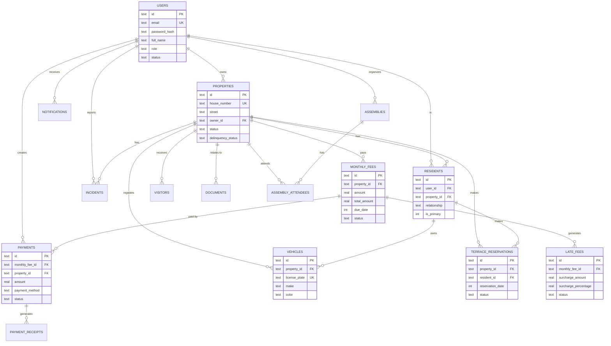

# Base de Datos - Sistema de Administración Paseo Coto Tonalá

## 📋 Tabla de Contenidos

- [Descripción General](#descripción-general)
- [Tecnología](#tecnología)
- [Estructura del Proyecto](#estructura-del-proyecto)
- [Esquema de Base de Datos](#esquema-de-base-de-datos)
- [Diagrama ER](#diagrama-er)
- [Instalación y Configuración](#instalación-y-configuración)
- [Migraciones](#migraciones)
- [Seeds](#seeds)
- [Convenciones y Mejores Prácticas](#convenciones-y-mejores-prácticas)
- [Reglas de Negocio](#reglas-de-negocio)

---

## 📖 Descripción General

Este directorio contiene el esquema completo de la base de datos para el sistema de administración del fraccionamiento "Paseo Coto Tonalá", que gestiona 130 propiedades residenciales.

### Características Principales

- ✅ Gestión de 130 propiedades
- ✅ Sistema de cuotas mensuales automatizado
- ✅ Descuentos por pago anticipado (10% días 1-16)
- ✅ Recargos por mora (15% mensual)
- ✅ Control de acceso y visitantes
- ✅ Censo vehicular obligatorio
- ✅ Reservación de terraza ($500 cuota, $300 devolución)
- ✅ Gestión documental
- ✅ Sistema de notificaciones multi-canal
- ✅ Auditoría completa de operaciones

---

## 🛠 Tecnología

- **Base de Datos**: SQLite (Cloudflare D1)
- **ORM**: Drizzle ORM
- **Migraciones**: SQL nativo
- **Formato de Timestamps**: Unix Epoch (segundos desde 1970-01-01)

---

## 📁 Estructura del Proyecto

```
database/
├── schema.sql                          # Esquema completo de la base de datos
├── README.md                           # Este archivo
├── migrations/                         # Migraciones individuales
│   ├── 001_create_users_table.sql
│   ├── 002_create_properties_table.sql
│   ├── 003_create_residents_table.sql
│   ├── 004_create_monthly_fees_table.sql
│   ├── 005_create_payments_table.sql
│   ├── 006_create_payment_receipts_table.sql
│   ├── 007_create_late_fees_table.sql
│   ├── 008_create_notifications_table.sql
│   ├── 009_create_visitors_table.sql
│   ├── 010_create_vehicles_table.sql
│   ├── 011_create_terrace_reservations_table.sql
│   ├── 012_create_documents_table.sql
│   ├── 013_create_incidents_table.sql
│   ├── 014_create_assemblies_table.sql
│   └── 015_create_audit_logs_and_settings_tables.sql
└── seeds/                              # Datos iniciales
    └── 001_seed_initial_data.sql
```

---

## 🗄 Esquema de Base de Datos

### Tablas Principales

#### 1. **users** - Usuarios del Sistema
Gestiona usuarios con roles: super_admin, admin, resident

**Campos principales:**
- `id`: Identificador único (UUID)
- `email`: Email único del usuario
- `password_hash`: Contraseña hasheada
- `full_name`: Nombre completo
- `role`: Rol del usuario (super_admin, admin, resident)
- `status`: Estado (active, inactive, suspended)
- `email_verified`: Verificación de email
- `deleted_at`: Soft delete

#### 2. **properties** - Propiedades del Fraccionamiento
130 casas del fraccionamiento

**Campos principales:**
- `id`: Identificador único
- `house_number`: Número de casa (único)
- `street`: Calle
- `block`: Manzana
- `owner_id`: Propietario (FK a users)
- `status`: Estado (occupied, vacant, rented)
- `delinquency_status`: Estado de morosidad (al_corriente, moroso_1mes, moroso_2mes, suspendido)
- `bedrooms`, `bathrooms`, `parking_spaces`: Características

#### 3. **residents** - Residentes
Información detallada de residentes por propiedad

**Campos principales:**
- `user_id`: Usuario (FK a users)
- `property_id`: Propiedad (FK a properties)
- `relationship`: Relación (owner, tenant, family, guest)
- `is_primary`: Residente principal
- `identification_type`: Tipo de identificación (INE, passport, license)
- `emergency_contact_name`, `emergency_contact_phone`: Contacto de emergencia

#### 4. **monthly_fees** - Cuotas Mensuales
Cuotas generadas automáticamente cada mes

**Campos principales:**
- `property_id`: Propiedad (FK)
- `amount`: Monto base
- `discount_amount`: Descuento aplicado
- `total_amount`: Total a pagar
- `due_date`: Fecha de vencimiento
- `payment_period`: Período (formato YYYY-MM)
- `status`: Estado (pending, paid, overdue, cancelled)
- `balance`: Saldo pendiente

#### 5. **payments** - Pagos
Registro de todos los pagos realizados

**Campos principales:**
- `monthly_fee_id`: Cuota pagada (FK)
- `amount`: Monto pagado
- `payment_method`: Método (cash, transfer, card, stripe, mercadopago)
- `payment_date`: Fecha de pago
- `status`: Estado (pending, completed, failed, refunded)
- `gateway_transaction_id`: ID de transacción de pasarela

#### 6. **payment_receipts** - Comprobantes de Pago
Recibos generados por pagos

**Campos principales:**
- `payment_id`: Pago (FK)
- `receipt_number`: Número de recibo (único)
- `receipt_url`: URL del PDF
- `pdf_generated`: Indicador de generación

#### 7. **late_fees** - Recargos por Mora
Recargos del 15% mensual sobre saldo vencido

**Campos principales:**
- `monthly_fee_id`: Cuota (FK)
- `base_amount`: Monto base
- `surcharge_percentage`: Porcentaje (15%)
- `surcharge_amount`: Monto del recargo
- `months_overdue`: Meses de atraso
- `status`: Estado (pending, paid, waived, cancelled)

#### 8. **notifications** - Notificaciones
Historial de notificaciones enviadas

**Campos principales:**
- `user_id`: Usuario (FK)
- `type`: Tipo (payment_reminder, payment_overdue, etc.)
- `channel`: Canal (email, sms, push, in_app, whatsapp)
- `status`: Estado (pending, sent, failed, read)
- `priority`: Prioridad (low, normal, high, urgent)

#### 9. **visitors** - Visitantes
Registro de acceso de visitantes

**Campos principales:**
- `property_id`: Propiedad visitada (FK)
- `name`: Nombre del visitante
- `identification_number`: Número de identificación
- `vehicle_plate`: Placas del vehículo
- `visit_type`: Tipo (social, service, delivery, contractor)
- `entry_time`, `exit_time`: Hora de entrada/salida

#### 10. **vehicles** - Censo Vehicular
Vehículos registrados (obligatorio)

**Campos principales:**
- `property_id`: Propiedad (FK)
- `make`, `model`, `color`: Características del vehículo
- `license_plate`: Placas (único)
- `vehicle_type`: Tipo (car, motorcycle, truck, van, suv)
- `access_control_number`: Número de control de acceso
- `is_active`: Activo/Inactivo

#### 11. **terrace_reservations** - Reservaciones de Terraza
Sistema de reservación ($500 cuota, $300 devolución)

**Campos principales:**
- `property_id`, `resident_id`: Propiedad y residente (FK)
- `reservation_date`: Fecha de reservación
- `event_type`: Tipo de evento
- `deposit_amount`: Depósito (500)
- `deposit_return_amount`: Devolución (300)
- `damage_deduction`: Deducción por daños
- `status`: Estado (pending, confirmed, cancelled, completed)

#### 12. **documents** - Gestión Documental
Documentos del fraccionamiento

**Campos principales:**
- `title`, `description`: Título y descripción
- `document_type`: Tipo (regulation, minutes, notice, contract, etc.)
- `file_url`: URL del archivo
- `is_public`: Público/Privado
- `property_id`: Propiedad relacionada (opcional)
- `version`: Versión del documento

#### 13. **incidents** - Incidencias
Reportes de problemas y mantenimiento

**Campos principales:**
- `incident_type`: Tipo (maintenance, security, noise, parking, etc.)
- `severity`: Severidad (low, medium, high, critical)
- `status`: Estado (reported, acknowledged, in_progress, resolved, closed)
- `assigned_to`: Asignado a (FK a users)
- `estimated_cost`, `actual_cost`: Costos

#### 14. **assemblies** - Asambleas
Convocatorias y asambleas

**Campos principales:**
- `assembly_type`: Tipo (ordinary, extraordinary, informative, emergency)
- `scheduled_date`: Fecha programada
- `quorum_required`: Quórum requerido (%)
- `agenda`: Orden del día (JSON)
- `resolutions`: Resoluciones (JSON)
- `voting_results`: Resultados de votaciones (JSON)

#### 15. **assembly_attendees** - Asistencia a Asambleas
Registro de asistencia

**Campos principales:**
- `assembly_id`: Asamblea (FK)
- `property_id`: Propiedad (FK)
- `attended`: Asistió (0/1)
- `represented_by`: Representado por
- `voting_rights`: Derechos de voto

#### 16. **audit_logs** - Logs de Auditoría
Registro completo de operaciones

**Campos principales:**
- `user_id`: Usuario que realizó la acción
- `action`: Acción realizada
- `entity_type`, `entity_id`: Entidad afectada
- `old_values`, `new_values`: Valores anteriores y nuevos (JSON)
- `ip_address`, `user_agent`: Información de la sesión

#### 17. **system_settings** - Configuración del Sistema
Configuraciones globales

**Campos principales:**
- `key`: Clave única
- `value`: Valor
- `data_type`: Tipo de dato (string, number, boolean, json)
- `category`: Categoría
- `is_public`: Público/Privado

---

## 🔗 Diagrama ER



---

## 🚀 Instalación y Configuración

### Requisitos Previos

- Node.js 18+
- Wrangler CLI (para Cloudflare D1)
- SQLite (para desarrollo local)

### Configuración Inicial

1. **Instalar dependencias:**
```bash
npm install
```

2. **Crear base de datos D1 (Producción):**
```bash
# Crear base de datos en Cloudflare
wrangler d1 create paseo-coto-db

# Actualizar wrangler.toml con el database_id
```

3. **Crear base de datos local (Desarrollo):**
```bash
# Crear base de datos SQLite local
wrangler d1 execute paseo-coto-db --local --file=database/schema.sql
```

---

## 🔄 Migraciones

### Aplicar Migraciones

#### Desarrollo (Local)
```bash
# Aplicar todas las migraciones
wrangler d1 execute paseo-coto-db --local --file=database/schema.sql

# O aplicar migraciones individuales
wrangler d1 execute paseo-coto-db --local --file=database/migrations/001_create_users_table.sql
wrangler d1 execute paseo-coto-db --local --file=database/migrations/002_create_properties_table.sql
# ... continuar con todas las migraciones
```

#### Producción
```bash
# Aplicar esquema completo
wrangler d1 execute paseo-coto-db --file=database/schema.sql

# O aplicar migraciones individuales
wrangler d1 execute paseo-coto-db --file=database/migrations/001_create_users_table.sql
# ... continuar con todas las migraciones
```

### Orden de Migraciones

Las migraciones deben aplicarse en orden numérico:

1. `001_create_users_table.sql` - Usuarios (base)
2. `002_create_properties_table.sql` - Propiedades (depende de users)
3. `003_create_residents_table.sql` - Residentes (depende de users y properties)
4. `004_create_monthly_fees_table.sql` - Cuotas (depende de properties)
5. `005_create_payments_table.sql` - Pagos (depende de monthly_fees)
6. `006_create_payment_receipts_table.sql` - Recibos (depende de payments)
7. `007_create_late_fees_table.sql` - Recargos (depende de monthly_fees)
8. `008_create_notifications_table.sql` - Notificaciones (depende de users)
9. `009_create_visitors_table.sql` - Visitantes (depende de properties)
10. `010_create_vehicles_table.sql` - Vehículos (depende de properties y residents)
11. `011_create_terrace_reservations_table.sql` - Reservaciones (depende de properties y residents)
12. `012_create_documents_table.sql` - Documentos (depende de properties y users)
13. `013_create_incidents_table.sql` - Incidencias (depende de properties y users)
14. `014_create_assemblies_table.sql` - Asambleas (depende de users y properties)
15. `015_create_audit_logs_and_settings_tables.sql` - Auditoría y configuración

---

## 🌱 Seeds

### Aplicar Seeds

#### Desarrollo (Local)
```bash
wrangler d1 execute paseo-coto-db --local --file=database/seeds/001_seed_initial_data.sql
```

#### Producción
```bash
wrangler d1 execute paseo-coto-db --file=database/seeds/001_seed_initial_data.sql
```

### Datos Incluidos en Seeds

- ✅ Usuario super admin inicial (email: admin@paseocototonala.com)
- ✅ 130 propiedades del fraccionamiento
- ✅ Configuraciones iniciales del sistema
- ✅ Usuario residente de ejemplo (opcional, para desarrollo)

**⚠️ IMPORTANTE:** Los hashes de contraseña en los seeds son ejemplos y DEBEN ser reemplazados en producción.

---

## 📝 Convenciones y Mejores Prácticas

### Nomenclatura

- **Tablas**: snake_case, plural (ej: `monthly_fees`, `payment_receipts`)
- **Columnas**: snake_case (ej: `house_number`, `created_at`)
- **IDs**: Usar `id` como clave primaria
- **Foreign Keys**: Usar `{tabla}_id` (ej: `property_id`, `user_id`)

### Timestamps

- Usar **Unix Epoch** (segundos desde 1970-01-01)
- Campos estándar: `created_at`, `updated_at`, `deleted_at`
- Triggers automáticos para actualizar `updated_at`

### Soft Deletes

- Usar campo `deleted_at` (INTEGER, nullable)
- Índices con `WHERE deleted_at IS NULL`
- No eliminar físicamente registros importantes

### Validaciones

- Usar `CHECK` constraints para valores enumerados
- Usar `UNIQUE` para campos únicos
- Usar `NOT NULL` para campos obligatorios
- Validaciones adicionales en capa de aplicación

### Índices

- Crear índices en:
  - Foreign keys
  - Campos de búsqueda frecuente
  - Campos de ordenamiento
  - Campos en WHERE clauses comunes

### JSON Fields

- Usar para datos estructurados variables
- Campos comunes: `metadata`, `tags`, `agenda`, `resolutions`
- Validar estructura en capa de aplicación

---

## 💼 Reglas de Negocio

### Sistema de Cuotas

1. **Generación Automática**
   - Cuotas generadas el día 1 de cada mes
   - Monto base configurable en `system_settings`

2. **Descuentos por Pago Anticipado**
   - 10% de descuento: días 1-16 del mes
   - Sin descuento: días 17-31 del mes
   - Configurable en `system_settings.early_payment_discount`

3. **Recargos por Mora**
   - 15% mensual sobre saldo vencido
   - Aplicado automáticamente después de la fecha de vencimiento
   - Acumulativo por cada mes de atraso

### Estados de Morosidad

- **al_corriente**: Sin adeudos
- **moroso_1mes**: 1 mes de atraso
- **moroso_2mes**: 2 meses de atraso
- **suspendido**: 3+ meses de atraso (suspensión de servicios)

### Reservación de Terraza

- **Cuota**: $500 MXN
- **Devolución**: $300 MXN (si no hay daños)
- **Deducción por daños**: Variable, del depósito
- Máximo 1 reservación activa por propiedad

### Censo Vehicular

- Obligatorio para todos los vehículos
- Máximo 3 vehículos por propiedad (configurable)
- Placas únicas en el sistema
- Sticker de identificación requerido

### Roles y Permisos

- **super_admin**: Acceso total al sistema
- **admin**: Gestión operativa, sin acceso a configuración crítica
- **resident**: Acceso limitado a su información y servicios

---

## 🔒 Seguridad

### Contraseñas

- Usar bcrypt con factor de costo 10+
- Nunca almacenar contraseñas en texto plano
- Implementar política de contraseñas fuertes

### Auditoría

- Registrar todas las operaciones críticas en `audit_logs`
- Incluir: usuario, acción, entidad, valores anteriores/nuevos
- Retener logs por tiempo indefinido

### Soft Deletes

- Usar para datos sensibles
- Permite recuperación de datos
- Mantiene integridad referencial

---

## 📊 Consultas Comunes

### Obtener propiedades morosas
```sql
SELECT p.house_number, p.street, p.delinquency_status, u.full_name
FROM properties p
LEFT JOIN users u ON p.owner_id = u.id
WHERE p.delinquency_status != 'al_corriente'
ORDER BY p.delinquency_status DESC;
```

### Cuotas pendientes del mes actual
```sql
SELECT p.house_number, mf.amount, mf.total_amount, mf.due_date
FROM monthly_fees mf
JOIN properties p ON mf.property_id = p.id
WHERE mf.status = 'pending'
  AND mf.payment_period = strftime('%Y-%m', 'now')
ORDER BY p.house_number;
```

### Vehículos registrados por propiedad
```sql
SELECT p.house_number, v.make, v.model, v.color, v.license_plate
FROM vehicles v
JOIN properties p ON v.property_id = p.id
WHERE v.is_active = 1
  AND v.deleted_at IS NULL
ORDER BY p.house_number, v.make;
```

### Visitantes del día
```sql
SELECT v.name, p.house_number, v.entry_time, v.exit_time, v.visit_type
FROM visitors v
JOIN properties p ON v.property_id = p.id
WHERE date(v.entry_time, 'unixepoch') = date('now')
ORDER BY v.entry_time DESC;
```

---

## 🆘 Soporte

Para preguntas o problemas con el esquema de base de datos:

- **Email**: admin@paseocototonala.com
- **Documentación**: Ver `PLAN_ARQUITECTONICO_PASEO_COTO_TONALA.md`

---

## 📄 Licencia

Propiedad de Paseo Coto Tonalá - Todos los derechos reservados.

---

**Última actualización**: 2026-05-23